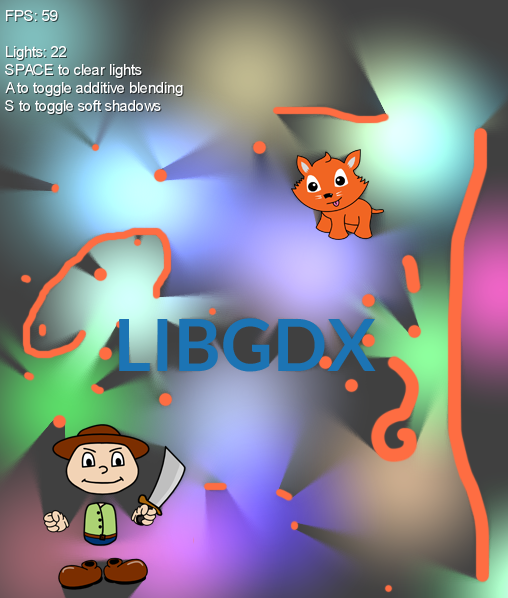
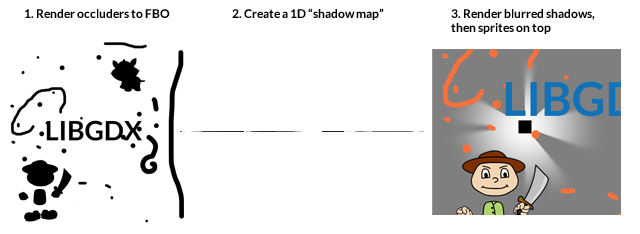
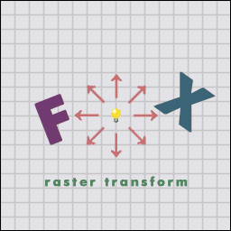
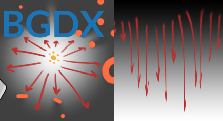
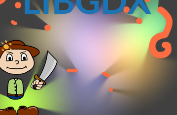

## Intro

Detailed here is an approach to 2D pixel-perfect lights/shadows using shaders and the GPU. Because of the high fill rate and multiple passes involved, this is generally less performant than geometry shadows (which are not per-pixel). My technique is implemented in LibGDX, although the concepts can be applied to any OpenGL/GLSL framework. 

The basic steps involved are (1) render occluders to a FBO, (2) build a 1D shadow map, (3) render shadows and sprites.  


The following animation best demonstrates what's happening:   
  
<sup>(Image from [this thread](http://www.gmlscripts.com/forums/viewtopic.php?id=1657))</sup>

The idea is an extension of my [previous attempts](http://www.java-gaming.org/topics/starbound-lighting-techneques/26363/msg/230988/view.html#msg230988) at shader-based shadows, which combines [ideas from various sources](#further-reading). My technique is inspired by Catalin Zima's [dynamic lighting](http://www.catalinzima.com/2010/07/my-technique-for-the-shader-based-dynamic-2d-shadows/), although the process discussed in this article is rather different and requires far fewer passes. As you can see I'm using the same placeholder graphics for the occluders.

Special thanks to "nego" on LibGDX forums, who suggested some great ideas to reduce the process into fewer passes.

## Step 1: Render To Occlusion Map

The first step is to render an "occlusion map" to an FBO. This way, our shader can sample our scene and determine whether an object is a shadow-caster (opaque), or not a shadow-caster (transparent). Our algorithm will expect the light to be at the center of this "occlusion map." We use a square power-of-two size for simplicity's sake; this will be the size of our light falloff, as well as the size of our various FBOs. The larger the size, the greater the falloff, but also the more fill-limited our algorithm will become.

To do this in LibGDX, we first need to set up a Frame Buffer Object like so:

```java
//lightSize is 256 by default

//create a FrameBufferObject with proper format and no depth
occludersFBO = new FrameBuffer(Format.RGBA8888, lightSize, lightSize, false);
```

Later we may want to "debug" our shadow rendering by drawing the resulting occlusion map to the screen. For this we need to define a TextureRegion for our FrameBuffer, which is done like so:
```java
//get color buffer texture of FBO for region
occluders = new TextureRegion(occludersFBO.getColorBufferTexture());
//flip it on Y-axis due to OpenGL coordinate system
occluders.flip(false, true);
```

If we don't plan on rendering the occluder map to the screen, we can skip the TextureRegion.

During our rendering pass, we draw to the occlusion map like so:
```java
//bind the occluder FBO
occludersFBO.begin();

//clear the FBO
Gdx.gl.glClearColor(0f,0f,0f,0f);
Gdx.gl.glClear(GL10.GL_COLOR_BUFFER_BIT);

//set the orthographic camera to the size of our FBO
cam.setToOrtho(false, occludersFBO.getWidth(), occludersFBO.getHeight());

//translate camera so that light is in the center 
cam.translate(mx - lightSize/2f, my - lightSize/2f);

//update camera matrices
cam.update();

//set up our batch for the occluder pass
batch.setProjectionMatrix(cam.combined);

//reset to default shader
batch.setShader(null); 
batch.begin();

  ... draw any sprites that cast shadows here ....
  ... opaque pixels will be shadow-casters, transparent pixels will not ...

//end the batch before unbinding the FBO
batch.end();

//unbind the FBO
occludersFBO.end();
```

We could use a custom shader here to encode specific data into our occlusion pass (such as [normals for diffuse lighting](https://github.com/mattdesl/lwjgl-basics/wiki/ShaderLesson6)). But for now we'll just use the default SpriteBatch shader, and only rely on sampling from the alpha channel. The resulting "occlusion map" might look like this -- with the light at center -- if we were to render the alpha channel in black and white:  


## Step 2: Build a 1D Shadow Map Lookup Texture

Now we need to build a 1D lookup texture, which will be used as our shadow/light map. The texture is very small (256x1 pixels), and looks like this:  


Our x-axis represents the angle `theta` of a "light ray" from center; i.e. 360 degrees of a circle. An easy way to visualize it is to imagine a few rays, like in the following:  


On the left, we see each ray being cast from the center (light position) to the first occluder (opaque pixel in our occlusion map). 

The texture on the right represents the "polar transform." The top (black) is the light center, and the bottom (white) is the light edge. We normalize the distance of each ray to `lightSize`, which we defined earlier. Each pixel in the resulting 1D shadow map describes the *minimum distance to the first occluder for that ray's angle*. So, if one of our red arrows does not hit any occluders, the normalized distance will be 1.0 (and thus the resulting pixel will be white). If the ray hits an occluder half way from center, the normalized distance will be 0.5 (and thus the resulting pixel will be gray). We take the *minimum* distance so that we "stop casting the ray" after hitting the first occluder (so to speak).

In our case, we have `lightSize` number of rays, or 256. The more rays, the more precision in our resulting shadows, but the greater the fill-rate.

There are a number of ways we could create this shadow map. One is described [here](http://www.java-gaming.org/topics/starbound-lighting-techneques/26363/msg/230988/view.html#msg230988), using blending modes. Thanks to "nego" on the LibGDX forums, I am now using a more efficient solution, which is done entirely in a shader. For each fragment on the x-axis, we iterate through each pixel of the occluder map on the Y axis, then sample using polar coordinates to determine whether we've hit a shadow-caster. We only store the distance if it's less than what we've already got. The GLSL code looks like this:

```glsl
#define PI 3.14

//inputs from vertex shader
varying vec2 vTexCoord0;

//uniform values
uniform sampler2D u_texture;
uniform vec2 resolution;

//alpha threshold for our occlusion map
const float THRESHOLD = 0.75;

void main(void) {
  float distance = 1.0;
  
  for (float y=0.0; y<resolution.y; y+=1.0) {
  		//rectangular to polar filter
		vec2 norm = vec2(vTexCoord0.s, y/resolution.y) * 2.0 - 1.0;
		float theta = PI*1.5 + norm.x * PI; 
		float r = (1.0 + norm.y) * 0.5;
		
		//coord which we will sample from occlude map
		vec2 coord = vec2(-r * sin(theta), -r * cos(theta))/2.0 + 0.5;
		
		//sample the occlusion map
		vec4 data = texture2D(u_texture, coord);
		
		//the current distance is how far from the top we've come
		float dst = y/resolution.y;
		
		//if we've hit an opaque fragment (occluder), then get new distance
		//if the new distance is below the current, then we'll use that for our ray
		float caster = data.a;
		if (caster > THRESHOLD) {
			distance = min(distance, dst);
			//NOTE: we could probably use "break" or "return" here
  		}
  } 
  gl_FragColor = vec4(vec3(distance), 1.0);
}
```

And the set up in Java looks like this for our FBO:
```java
//our 1D shadow map, lightSize x 1 pixels, no depth
shadowMapFBO = new FrameBuffer(Format.RGBA8888, lightSize, 1, false);
Texture shadowMapTex = shadowMapFBO.getColorBufferTexture();

//use linear filtering and repeat wrap mode when sampling
shadowMapTex.setFilter(TextureFilter.Linear, TextureFilter.Linear);
shadowMapTex.setWrap(TextureWrap.Repeat, TextureWrap.Repeat);

//for debugging only; in order to render the 1D shadow map FBO to screen
shadowMap1D = new TextureRegion(shadowMapTex);
shadowMap1D.flip(false, true);
```

The rendering steps are relatively straight-forward:

```java
//bind shadow map FBO
shadowMapFBO.begin();

//clear it
Gdx.gl.glClearColor(0f,0f,0f,0f);
Gdx.gl.glClear(GL10.GL_COLOR_BUFFER_BIT);

//set our shadow map shader
batch.setShader(shadowMapShader);

//start rendering
batch.begin();

//give the shader our lightSize resolution
shadowMapShader.setUniformf("resolution", lightSize, lightSize);

//reset our projection matrix to the FBO size
cam.setToOrtho(false, shadowMapFBO.getWidth(), shadowMapFBO.getHeight());
batch.setProjectionMatrix(cam.combined);

//draw the occluders texture to our 1D shadow map FBO
batch.draw(occludersFBO.getColorBufferTexture(), 0, 0, lightSize, shadowMapFBO.getHeight());

//flush batch
batch.end();

//unbind shadow map FBO
shadowMapFBO.end();
```

## Step 3. Blur & Render Lights

The next step is to render our lights by sampling from our 1D shadow map lookup texture. 

The basic idea is: for each fragment in our light area, determine if the distance from center is less than the distance for that angle in our 1D shadow map. If true, the fragment is "in light." If false, the fragment is "in shadow." 

In order to create blurred edges, we need to sample multiple angles, and sum the results together using a gaussian distribution.

The GLSL code for light rendering looks like this:

```glsl
#define PI 3.14

//inputs from vertex shader
varying vec2 vTexCoord0;
varying LOWP vec4 vColor;

//uniform values
uniform sampler2D u_texture;
uniform vec2 resolution;

//sample from the 1D distance map
float sample(vec2 coord, float r) {
	return step(r, texture2D(u_texture, coord).r);
}

void main(void) {
	//rectangular to polar
	vec2 norm = vTexCoord0.st * 2.0 - 1.0;
	float theta = atan(norm.y, norm.x);
	float r = length(norm);	
	float coord = (theta + PI) / (2.0*PI);
	
	//the tex coord to sample our 1D lookup texture	
	//always 0.0 on y axis
	vec2 tc = vec2(coord, 0.0);
	
	//the center tex coord, which gives us hard shadows
	float center = sample(tc, r);        
	
	//we multiply the blur amount by our distance from center
	//this leads to more blurriness as the shadow "fades away"
	float blur = (1./resolution.x)  * smoothstep(0., 1., r); 
	
	//now we use a simple gaussian blur
	float sum = 0.0;
	
	sum += sample(vec2(tc.x - 4.0*blur, tc.y), r) * 0.05;
	sum += sample(vec2(tc.x - 3.0*blur, tc.y), r) * 0.09;
	sum += sample(vec2(tc.x - 2.0*blur, tc.y), r) * 0.12;
	sum += sample(vec2(tc.x - 1.0*blur, tc.y), r) * 0.15;
	
	sum += center * 0.16;
	
	sum += sample(vec2(tc.x + 1.0*blur, tc.y), r) * 0.15;
	sum += sample(vec2(tc.x + 2.0*blur, tc.y), r) * 0.12;
	sum += sample(vec2(tc.x + 3.0*blur, tc.y), r) * 0.09;
	sum += sample(vec2(tc.x + 4.0*blur, tc.y), r) * 0.05;
	
	//sum of 1.0 -> in light, 0.0 -> in shadow
 	
 	//multiply the summed amount by our distance, which gives us a radial falloff
 	//then multiply by vertex (light) color  
 	gl_FragColor = vColor * vec4(vec3(1.0), sum * smoothstep(1.0, 0.0, r));
}
```

The Java code is rather straight-forward:
```java
//reset projection matrix to screen size
cam.setToOrtho(false);
batch.setProjectionMatrix(cam.combined);

//set the shader which actually draws the light/shadow 
batch.setShader(shadowRenderShader);
batch.begin();

//give shader our light size (256 by default)
shadowRenderShader.setUniformf("resolution", lightSize, lightSize);

//set color to light
batch.setColor(o.color);

//draw light centered on light position
batch.draw(shadowMap1D.getTexture(), mx-lightSize/2f, my-lightSize/2f, lightSize, lightSize);

//flush the batch before swapping shaders
batch.end();

//reset color
batch.setColor(Color.WHITE);
```

And voila! With a few different lights and some additive blending, we can get some very pretty per-pixel soft shadows:  


## Source Code

The demo is implemented in LibGDX. You can find the source here:  
https://gist.github.com/mattdesl/5286905

The test images can be downloaded here:  
[cat4.png](images/yVkiKwx.png)
[light.png](images/s7W3FDr.png)

## Optimizations

On my Mac OSX 10.6.6 (GeForce 9400), I can add about 20 lights before fill-rate becomes a bottleneck.

The code listed here is *not* optimized, and will not perform well on Android. There are many areas that can be improved:

- Rendering multiple occlusion maps in a single pass, to a large texture atlas. Or, using fixed occlusion maps that fit within the target texture size (e.g. 4096x4096), in order to skip one render-to-texture pass.
- Rendering multiple shadow maps into the same texture. We could fit 4 into a single `Nx1` texture, since we have R, G, B, and A channels. Or, we could fit more data into a map with a larger height.
- Using smaller occlusion and shadow map texture sizes, and then up-scaling when rendering the final shadows. This comes at the expense of precision. You can test this in the demo by changing `lightSize` and `upScale`.
- Using non-dependent texture reads, [described here](http://xissburg.com/faster-gaussian-blur-in-glsl/)
- Sampling *between* texel centers to utilize linear filtering, [described here](http://prideout.net/archive/bloom/#Sneaky)
- Separating the blur pass may also prove valuable, depending on the situation. 
- If the desired light is to be a cone (instead of a 360 degrees circle), there are many optimizations that can be made to the shadow maps without losing any precision.
- Rendering using disc/circle meshes to further reduce fill-rate

## Future Thoughts

It may be possible to take advantage of hardware depth testing to build our shadow map, or perhaps use multiple-render targets to improve performance and reduce passes for many lights. However, as these features are not supported in OpenGL ES, I chose not to use them.

<a name="further-reading" />
## Further Reading

- [Catalin's Article, the original inspiration](http://www.catalinzima.com/2010/07/my-technique-for-the-shader-based-dynamic-2d-shadows/)
- http://rabidlion.com/?p=10
- http://www.gmlscripts.com/forums/viewtopic.php?id=1657