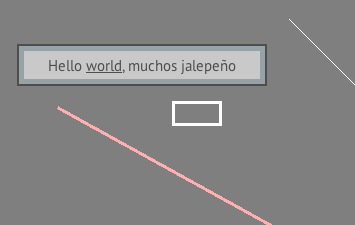

Often you may want to render rectangles, lines, and squares -- be it for debugging or any other visual purpose. In the programmable pipeline there is no longer `glRect` nor can you simply "disable textures" to render a primitive shape. The solution is to find a 1x1 white opaque pixel in your UI texture atlas from which to sample from (or more than 1x1 pixels if you are scaling with `GL_LINEAR`). Then, you can render boxes, lines, and other basic shapes. 

In Photoshop, I added a small 4x4 white square to the corner of my font texture atlas: see [here](https://github.com/mattdesl/lwjgl-basics/blob/master/test/res/ptsans_00.png). I then grabbed it with a TextureRegion. We also could have created a 1x1 white `GL_NEAREST` Texture with a ByteBuffer (see [here](https://github.com/mattdesl/lwjgl-basics/wiki/Java-NIO-Buffers)), but having multiple textures would not allow us to take advantage of our SpriteBatch. 

Here are a couple of utility methods for rendering lines and rectangles:

```java
void drawRect(int x, int y, int width, int height, int thickness) {
	batch.draw(rect, x, y, width, thickness);
	batch.draw(rect, x, y, thickness, height);
	batch.draw(rect, x, y+height-thickness, width, thickness);
	batch.draw(rect, x+width-thickness, y, thickness, height);
}

void drawLine(int x1, int y1, int x2, int y2, int thickness) {
	int dx = x2-x1;
	int dy = y2-y1;
	float dist = (float)Math.sqrt(dx*dx + dy*dy);
	float rad = (float)Math.atan2(dy, dx);
	batch.draw(rect, x1, y1, dist, thickness, 0, 0, rad); 
}
```

You can see them in use in [RectTest](https://github.com/mattdesl/lwjgl-basics/blob/master/test/mdesl/test/RectTest.java):



This is a very simple means of rendering shapes. The technique in this article relies on the CPU to transform each vertex of the line sprite; and under the hood it's made up of two triangles, i.e. 6 vertices. That's a lot of work just to render a 1 px line segment! For filled polygons, anti-aliasing, stroke effects, and so forth, we may need to take advantage of fragment and geometry shaders. In some other cases, `GL_LINES` would be much more effective -- but that has its own set of drawbacks.


## Further Reading

- [Advanced line rendering in OpenGL](http://artgrammer.blogspot.ca/search/label/opengl)
- [Smoothed and rounded end-cap lines in iOS](http://programming4.us/multimedia/3348.aspx)
- [Drawing Nearly Perfect 2D Line Segments in OpenGL](http://www.codeproject.com/Articles/199525/Drawing-nearly-perfect-2D-line-segments-in-OpenGL)
- [Drawing Lines with Tessellated Polygons](http://www.codeproject.com/Articles/226569/Drawing-polylines-by-tessellation) 
- [Drawing lines with GL 3.0+ Geometry Shaders](http://prideout.net/blog/?p=61)
- [FXAA](http://developer.download.nvidia.com/assets/gamedev/files/sdk/11/FXAA_WhitePaper.pdf) is a good alternative to built-in hardware anti-aliasing, which is often unreliable
- [Bezier Curves in 2D](http://www.codeproject.com/Articles/25237/Bezier-Curves-Made-Simple)
- [Resolution-Independent Curve Rendering on the GPU](http://research.microsoft.com/en-us/um/people/cloop/loopblinn05.pdf) - also see [here](http://www.pixelnerve.com/v/2010/05/11/evaluate-a-cubic-bezier-on-gpu/) and [here](http://web.engr.oregonstate.edu/~mjb/glman/ClassNotes/geometry_shader.pdf)