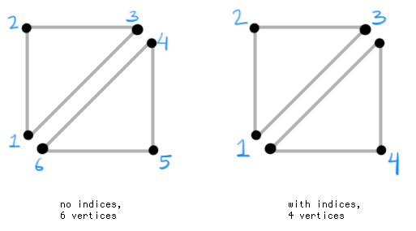

**Note:** This page is not complete...

This is an advanced tutorial that will deal with shaders, meshes, camera matrices, texture handling, and various other concepts. Ensure you have read and understand the following before continuing:

- [Handling Textures in LibGDX](LibGDX-Textures)
- [Shader Tutorial Series](Shaders)
- [Intro to Sprite Batchers](Sprite-Batching)

## Objective

As we know from previous tutorials, we can send float data to a shader with *uniforms* (vec2, vec3, etc). The problem is, however, that we need to flush the SpriteBatch before changing the uniform. Imagine each of our sprites require a different uniform value; this would lead to a lot of flushing, and it defeats the benefits of a SpriteBatch in the first place. 

The solution is to use *vertex attributes* -- this allows us to send data to the shader *per-vertex* as opposed to *per-batch*. We already use vertex attributes to send RGBA colors per sprite, or texture coordinates per vertex. There are a number of situations where custom vertex data will prove useful, but for our cases let's use it for multi-texturing.

## Theoretical Puzzle Game

Let's say we're developing a simple puzzle game with many varieties of jigsaw pieces. Here are a couple of them:  


Here is an example of a photo we'd like to slice up:  


We could develop this app in a number of ways, but for the purpose of the tutorial we'll implement a solution that applies the mask in real-time. This means that our "photo" source could actually be a dynamic image (like a rotating 3D cube rendered to FBO), or a video (like webcam input). It also means the user can choose their own photos (e.g. from their phone) and crop/pan/zoom them as desired.

We *could* apply the same techniques discussed in [Shader Lesson 4](ShaderLesson4) to achieve the masking, and we'd probably get decent frame rates. However, for more optimized rendering, such as a scene with *many* jigsaw pieces, we may need a different technique. The "big two" optimizations in 2D sprite rendering are:

- Reducing texture binds by packing all sprites into a TextureAtlas.
- "Batching" many sprites into a single draw call

To achieve these optimizations, we need to send specific data to the shader that can't be achieved with a regular SpriteBatch. The data we need for each vertex:

- `Position.xy` - the position of the vertex
- `Color.rgba` - the color of the vertex, allowing us to tint and fade puzzle pieces
- `TexCoord0.st` - the texture coordinates for the "source" texture
- `TexCoord1.st` - the texture coordinates for the "jigsaw" texture

This will allow us to pack all of our jigsaw pieces into the same TextureAtlas, and draw a masked piece like this with any "source" image:  


## Creating a Mesh

In LibGDX, we use the Mesh class to hold vertex data for us. The data is essentially just an array of floats which we pass to OpenGL. 

For example, with the above vertex attributes, our array might look something like this:
```java
float[] data = new float[] {
		//VERTEX 1....
		x, y,       //Position.xy
		r, g, b, a, //Color.rgba 
		s0, t0,     //TexCoord0.st 
		s1, t1,     //TexCoord1.st
		
		//VERTEX 2...
		//etc...
};
```

As you can see, we are using 10 floats per vertex. We need three vertices to create a triangle. Keep in mind, to create a "quad", we need two triangles side by side. Since some of our vertices are the same, we can use "array indices" to minimize the number of vertices sent to OpenGL. See the image here:  


If we didn't use indices, we would need to define 60 floats for a quad (10 floats * 6 vertices). With array indices, we only need to define 40 floats for a quad (10 floats * 4 vertices). Using clockwise winding and starting at the lower-left origin, our array indices might be `{ 0, 1, 2, 2, 3, 0 }` for the above quad. 

```java
Mesh(VertexDataType type, boolean isStatic, int vertCount, int indexCount, VertexAttribute ... attributes)
```

Above is the Mesh constructor. We first need to specify the 'data type'; this will define how the vertex attributes will be handled by OpenGL. There are a couple of options such as Vertex Buffer Objects (VBOs) or Vertex Arrays. Which to choose depends on your target device(s) and the way you are using your mesh; but for our purposes, we will use Vertex Arrays since that's what SpriteBatch uses. Then we specify whether our data is static; since we plan to change it every frame, pass `false`. 

Then we determine the size of our batch. Say we want to squeeze 100 quads into a single draw call, then we need our batch to be large enough to fit all of that data. Our indexed quad uses 4 vertices and 6 indices, so the size is computed like so:

```java
int batchSize = 100; //100 quads per batch
int vertCount = 4 * batchSize; //number of vertices
int indexCount = 6 * batchSize; //number of indices
```

The last varargs parameter to Mesh specifies our Vertex Data layout. We use the VertexAttribute class to pass the usage (position, color, etc), number of components (vec2, vec4, etc), and attribute name for the shader (e.g. "a_position" or `ShaderProgram.POSITION_ATTRIBUTE`). With all of this, we can begin creating our own PuzzleBatch class.

Here is what our constructor looks like so far:

```java
public PuzzleBatch(int batchSize) {
	//since we are using shaders, we need GL20
	if (!Gdx.graphics.isGL20Available())
		throw new GdxRuntimeException("PuzzleBatch requires GLES20");
				
	//the size of our batch
	int vertexCount = 4 * batchSize;
	int indexCount = 6 * batchSize;
	
	//create the mesh with our specific vertex attributes
	mesh = new Mesh(VertexDataType.VertexArray, false, vertexCount, indexCount,
			new VertexAttribute(Usage.Position, 2, ShaderProgram.POSITION_ATTRIBUTE), 
			new VertexAttribute(Usage.Color, 4, ShaderProgram.COLOR_ATTRIBUTE), 
			new VertexAttribute(Usage.TextureCoordinates, 2, ShaderProgram.TEXCOORD_ATTRIBUTE+"0"),
			new VertexAttribute(Usage.TextureCoordinates, 2, ShaderProgram.TEXCOORD_ATTRIBUTE+"1"));
	
	//indices in the format { 0, 1, 2, 2, 3, 0 } per sprite
	short[] indices = new short[batchSize * 6];
	for (int i = 0, j = 0; i < indices.length; i += 6, j += 4) {
		indices[i + 0] = (short)(j + 0);
		indices[i + 1] = (short)(j + 1);
		indices[i + 2] = (short)(j + 2);
		indices[i + 3] = (short)(j + 2);
		indices[i + 4] = (short)(j + 3);
		indices[i + 5] = (short)(j + 0);
	}
	
	//set the indices on this mesh
	mesh.setIndices(indices);
	
	//the number of floats per vertex, as specified by our VertexAttributes
	final int numComponents = 10;
	
	//the number of floats per quad -- 4 verts * 10 floats
	quadSize = 4 * numComponents;
	
	//our vertex array needs to be able to hold enough floats for each vertex in our batch
	vertices = new float[batchSize * quadSize];
	
	//...
```

## Projection Matrix

Since we are using a custom shader, we need to provide it with a projection matrix. This will transform the 2D screen-space positions into something OpenGL can use for rendering. So, we'll append the following to our PuzzleBatch constructor:

```java
u_projTrans = new Matrix4();
u_projTrans.setToOrtho2D(0, 0, Gdx.graphics.getWidth(), Gdx.graphics.getHeight());
```

Alternatively, we could use the combined matrix from an OrthographicCamera:
```java
u_projTrans = camera.combined;
```

## Creating a Basic Shader

Next, we will make a simple shader. We don't need to worry about blending or texture sampling at this stage; for now we will just return the color red for testing purposes. Notice that we need to specify each attribute and its associated varying that we defined with VertexAttribute. The names and component count (vec2, vec4) needs to match!

The following code looks a little daunting; but it's actually just a basic shader like the ones we've seen in the [Shaders tutorials](Shaders). You can see the resulting GLSL source [here](https://gist.github.com/mattdesl/5172873).

```java
/** The shader uniform name of the projection/transform matrix - "u_projTrans" */
public static final String U_PROJECTION_MATRIX = "u_projTrans";
/** The shader uniform name of the texture0 sampler (source photo) - "u_texture0" */
public static final String U_TEXTURE0 = "u_texture0";
/** The shader uniform name of the texture1 sampler (jigsaw mask) - "u_texture1" */
public static final String U_TEXTURE1 = "u_texture1";

/** The source for the vertex shader. */
public static final String VERT_SRC = 
		  //vertex attributes
		  "attribute vec4 " + ShaderProgram.POSITION_ATTRIBUTE + ";\n"
		+ "attribute vec4 " + ShaderProgram.COLOR_ATTRIBUTE + ";\n" 
		+ "attribute vec2 " + ShaderProgram.TEXCOORD_ATTRIBUTE + "0;\n" 
		+ "attribute vec2 " + ShaderProgram.TEXCOORD_ATTRIBUTE + "1;\n\n"
		  //projection matrix
		+ "uniform mat4 " + U_PROJECTION_MATRIX +";\n\n"
		  //attributes sent to frag shader
		+ "varying vec2 vTexCoord0;\n" 
		+ "varying vec2 vTexCoord1;\n"
		+ "varying vec4 vColor;\n"
		+ "\n"
		+ "void main() {\n" 
		+ "  vColor = " + ShaderProgram.COLOR_ATTRIBUTE + ";\n"
		+ "  vTexCoord0 = " + ShaderProgram.TEXCOORD_ATTRIBUTE + "0;\n" 
		+ "  vTexCoord1 = " + ShaderProgram.TEXCOORD_ATTRIBUTE + "1;\n" 
		+ "  gl_Position = u_projTrans * " + ShaderProgram.POSITION_ATTRIBUTE + ";\n" 
		+ "}";

/** The source for the fragment shader. */
public static final String FRAG_SRC =
		  "#ifdef GL_ES\n"
		+ "#define LOWP lowp\n" 
		+ "precision mediump float;\n" 
		+ "#else\n" 
		+ "#define LOWP \n" 
		+ "#endif\n\n"
		  //attributes from vertex shader
		+ "varying vec2 vTexCoord0;\n"
		+ "varying vec2 vTexCoord1;\n"
		+ "varying LOWP vec4 vColor;\n\n" //colors use LOWP precision
		  //our samplers, the photo and jigsaw mask
		+ "uniform sampler2D "+U_TEXTURE0+";\n"
		+ "uniform sampler2D "+U_TEXTURE1+";\n"
		+ "\n"			
		+ "void main(void) {\n"
		+ "  vec4 texColor0 = texture2D("+U_TEXTURE0+", vTexCoord0);\n"
		+ "  vec4 texColor1 = texture2D("+U_TEXTURE1+", vTexCoord1);\n"
		  //For now we'll just return red
		+ "  gl_FragColor = vec4(1.0, 0.0, 0.0, 1.0);\n" 
		+ "}";

/** 
 * Compiles a new instance of the default shader for this batch and returns it. If compilation
 * was unsuccessful, GdxRuntimeException will be thrown.
 * @return the default shader
 */
public static ShaderProgram createDefaultShader() {
	ShaderProgram prog = new ShaderProgram(VERT_SRC, FRAG_SRC);
	if (!prog.isCompiled())
		throw new GdxRuntimeException("could not compile splat batch: " + prog.getLog());
	if (prog.getLog().length() != 0)
		Gdx.app.log("PuzzleBatch", prog.getLog());
	return prog;
}
```