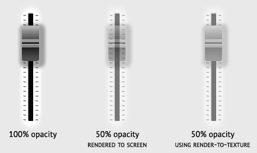
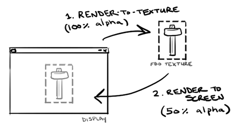
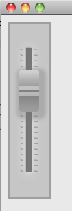
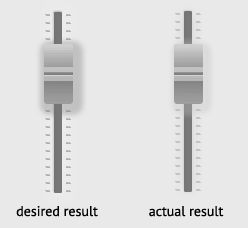

##### [start](https://github.com/mattdesl/lwjgl-basics/wiki) » Frame Buffer Objects
***

This series relies on the minimal [lwjgl-basics](https://github.com/mattdesl/lwjgl-basics) API for FrameBuffer and rendering utilities. The code has also been [Ported to LibGDX](https://gist.github.com/4393861). The concepts should be universal enough that they could be applied to SDL, Android, iOS, WebGL, or any other platforms that support OpenGL. 

***

A common feature in 2D and 3D graphics programming is the ability to render to a texture. For example, say we have a slider GUI component made up of multiple sprites (the track, and the thumb button), and we are trying to fade it in/out. When we render each sprite at 50% opacity, we get some ugly blending where the sprites meet.



(Slider PSD can be downloaded [here](http://files.pixelsdaily.com/download/id/2950))

In the middle we see the problem when we render both sprites to the screen at 50%. The desired effect, on the right, is achieved by rendering the sprites at 100% to an "offscreen texture", *then* render that texture to the screen at 50% opacity.



Another use for render-to-texture is for post-processing effects; i.e. rendering your sprites to an offscreen texture as large as the game window, and then render that texture to the screen with a shader which applies the effects.

## A Quick Note

Before continuing, it should be pointed out that using FBOs, especially rendering to them every frame, may not lead to the best performance. This is because they require many state switch, batch flushes, buffer clears, and shader updates (i.e. sending new viewport size). Use them wisely.

## Frame Buffer Objects

In OpenGL, in order to render-to-texture, we need to set up a Frame Buffer Object (FBO). We will use the Framebuffer utility to make things a bit easier. You can loosely think of FBOs as a means of "switching screens" in GL. Generally you render to the default "screen" of the Display (or **back buffer**), but with an FBO you can define other screens to render to. 

First, we create a new frame buffer object:
```java
try {
	fbo = new FrameBuffer(width, height, Texture.NEAREST);
} catch (LWJGLException e) {
	... if the FBO could not be created ...
}
```

For maximum compatibility and efficiency, you should stick to power-of-two sizes. The frame buffer is backed by a texture, so it has the same hardware limitations discussed in the [Textures tutorial](Textures#wiki-HardwareLimitations).

You can check to see if frame buffer objects are supported in hardware with `Framebuffer.isSupported()`. If it returns `false`, then you will get an error when you try to create a frame buffer. This is generally only a problem on very old drivers, most of which will not work with shaders anyways, and so are not worth our time. To give you an idea of support, about [93% of drivers](http://feedback.wildfiregames.com/report/opengl/) support `GL_EXT_framebuffer_object`. Users that don't support this are probably not going to be able to run shaders, either, and you'd be better off telling them to update their graphics card and drivers.

Here is some pseudo-code to render sprites to a texture using a frame buffer object:

```
//make the FBO the current buffer
fbo.begin()

//... clear the FBO color with transparent black ...
glClearColor(0f, 0f, 0f, 0f); //transparent black
glClear(GL_COLOR_BUFFER_BIT); //clear the color buffer

//since the FBO may not be the same size as the display, 
//we need to give the SpriteBatch our new screen dimensions
batch.resize(fbo.getWidth(), fbo.getHeight());

//render some sprites 
batch.begin();

//draw our track and thumb button
batch.draw(track, ...);
batch.draw(slider, ...);

batch.end(); //flushes data to GL

//now we can unbind the FBO, returning rendering back to the default back buffer (the Display)
fbo.end();

//reset the batch back to the Display width/height
batch.resize(Display.getWidth(), Display.getHeight());

//now we are rendering to the back buffer (Display) again
batch.begin();

//draw our offscreen FBO texture to the screen with the given alpha
batch.setColor(1f, 1f, 1f, alpha);
batch.draw(fbo, 0, 0);

batch.end();
```

Now, if we were to test this with the following sprite sheet:


Everything will look right at 50%:



<a name="Blending" />

## Blending Woes

Ok, that opaque background behind the slider looks pretty ugly... But as soon as we get rid of it (using [this]() texture atlas), we get some loss of information in the alpha channel:



This occurs because we are blending *twice*. When we draw the track and thumb sprites to the FBO, we are blending them with the background. Then, when we draw the sprites to the screen, we are blending again -- this second blend is causing the result to look more transparent than it should.

One solution would be to use `glDisable(GL_BLEND)` before drawing to our FBO, or to use a blend function that does not blend with the destination (background). Unfortunately, since we are rendering one semi-transparent sprite atop another, we need to utilize the destination and blending. Another solution is to do the following:

1. Clear the FBO to transparent black `(0, 0, 0, 0)`.
2. Set the RGB blend func to `GL_SRC_ALPHA, GL_ONE_MINUS_SRC_ALPHA` and the Alpha blend func to `GLONE, GL_ONE`.
3. Render the sprites at 100% opacity to the FBO.
4. End the batch and unbind the FBO.
5. Enable "pre-multipled alpha" blending, `GL_ONE, GL_ONE_MINUS_SRC_ALPHA`.
6. Use `batch.setColor(alpha, alpha, alpha, alpha)` to adjust opacity.
7. Render the FBO color texture.

You can see the resulting code in the [FBOTest](https://github.com/mattdesl/lwjgl-basics/blob/master/test/mdesl/test/FBOTest.java) example. The output:


## Full-Screen FBOs and Post-Processing

As discussed earlier, some older drivers won't support non-power-of-two textures. This can be a bit of a pain when we're working with full-screen FBO textures, since the screen dimensions are rarely power-of-two.

The solution is to use a TextureRegion to render only a portion of our power-of-two frame buffer. However, since GL assumes lower-left origin and TextureRegion assumes upper-left, we need to flip the Y texcoord in order for it to render correctly. 

```java
	TextureRegion fboRegion; //the region of our POT frame buffer
	FrameBuffer fbo; //our POT frame buffer with a color texture attached

	...
		if (Texture.isNPOTSupported()) {
			fbo = new FrameBuffer(width, height);
			fboRegion = new TextureRegion(fbo.getTexture());
		} else {
			int texWidth = Texture.toPowerOfTwo(width);
			int texHeight = Texture.toPowerOfTwo(height);
			fbo = new FrameBuffer(texWidth, texHeight);
			fboRegion = new TextureRegion(fbo.getTexture(), 0, texHeight-height, width, height);
		}
		fboRegion.flip(false, true);
	...
```

Then, our post-processing system would look something like this:

```java

//make offscreen texture active
fbo.begin(); 

//standard shader
batch.setShader(DEFAULT_SHADER);

//if FBO size == Display size, we can omit this
batch.resize(fbo.getWidth(), fbo.getHeight());

batch.begin();
... render all sprites here ...
batch.end();

//unbind FBO
fbo.end();

//now apply post-processing
batch.setShader(POST_PROCESS_SCENE);

//resize to display since we are no longer rendering to a FBO texture
batch.resize(Display.getWidth(), Display.getHeight());

//draw screen, will be affected by shader
batch.begin();
batch.draw(fboRegion, 0, 0);
batch.end();
```

## Other APIs

The `slider.png` sheet can be downloaded [here](https://github.com/mattdesl/lwjgl-basics/blob/master/test/res/slider.png).

- [Ported to LibGDX](https://gist.github.com/4393861)