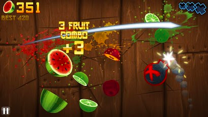
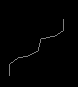
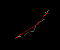
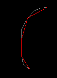
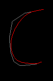
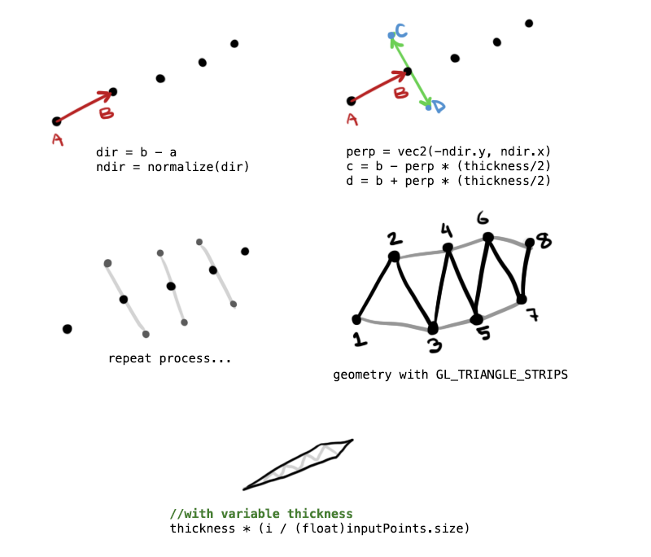
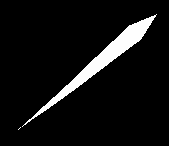
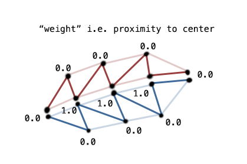

##### [start](https://github.com/mattdesl/lwjgl-basics/wiki) » LibGDX Finger Swipe

***

This article relies on [LibGDX](http://libgdx.badlogicgames.com/) for mesh and rendering utilities. The concepts should be universal enough that they could be applied to LWJGL, iOS, or any other platforms built on OpenGL. 

***

# Intro

Surely most of you are familiar with the Fruit Ninja type of games. This series will cover replicating the Swipe effect in OpenGL ES using LibGDX.

  
<sup>Screenshot from Fruit Ninja, a popular touch-based game</sup>


The final result of our swipe renderer will look like this:  


Below is a break-down of the steps involved:

1. [Capture Input](#Input)
2. [Simplify Input](#Simplify)
3. [Smooth Input](#Smooth)
4. [Extrude To Triangle Strip](#Extrude)
5. [Fast Anti-Aliasing and Stroke Effects](#Stroke)
6. [Optimizations](#Optimizations)

<a name="Input" />
## 1. Capture Touch Input

The first step is very simple. We need to capture the last N input points and store them in a list. For this we will shift all current elements in the list to the right, and then replace the first element with our new input point. Using LibGDX's Array utility, we can "insert" elements without growing the backing array like so:

```java
// direct access REQUIRES that we created the Array with the Class<T> constructor
Vector2[] items = list.items;

// increase size if we have a new point
// items.length (array size) represents our fixed-length capacity
list.size = Math.min(list.size + 1, items.length);

// shift elements right
for (int i = list.size - 1; i > 0; i--) {
	items[i] = items[i - 1];
}

// insert new item at first index
items[0] = t;
```

We insert our first point in `touchDown`, and subsequent points in `touchDragged`.

Note that direct access to Array's `list` only works if we created the array with the `Class<T>` constructor. You can see my [FixedList implementation here](https://gist.github.com/mattdesl/5002527). You may choose to modify an existing Java collection, instead.

We determine how many input points to "remember" by setting the Array's capacity. Using a greater capacity will lead in longer "swipe trails," while smaller capacity will lead to shorter trials. 

<a name="Simplify" />
## 2. Simplify Input Path

The first problem you might notice is that merely touching the screen is registered as a swipe. We don't want a swipe to be registered unless the user actually performs a swipe gesture. A quick fix is to only insert new points if they exceed a *minimum distance* from our last point. This forces the user to put a little more effort into their swipes, and discards very small swipes. It will also help us simplify the lines a little, reducing the point count, which will prove useful in our next step. 

```java
//determine squared distance between input and last point
float lenSq = tmpVec.set(inputPoint).sub(lastPoint).len2();

//the minimum distance between input points, squared
if (lenSq >= minDistanceSq) {
    ... insert new point ...
}
```

Another issue becomes apparent when we try swiping on an actual Android device. The touch screen input is not always accurate -- leading to "zig-zag" or stepped paths whenever the user tries to swipe diagonally. The effect is demonstrated [here](http://obamapacman.com/2010/01/iphone-wins-smartphone-touchscreen-performance-test-better-than-nexus-one-droid/) and leads to ugly diagonal swipes like this:  


Our above distance check is pretty much the equivalent to the below [radial distance](http://psimpl.sourceforge.net/radial-distance.html) algorithm, adapted from [simplify.js](http://mourner.github.com/simplify-js/). This second distance check gives us a little more control over how we want the input to be simplified; but you may want to improve on this algorithm with Douglas-Peucker, Perpendicular Distance, or something more specialized.

An `out` parameter is used to avoid allocating new objects in the game loop.

```java
public static void simplify(Array<Vector2> points, float sqTolerance, Array<Vector2> out) {
	int len = points.size;

	Vector2 point = new Vector2();
	Vector2 prevPoint = points.get(0);
	
	out.clear();
	out.add(prevPoint);
	
	for (int i = 1; i < len; i++) {
		point = points.get(i);
		if (distSq(point, prevPoint) > sqTolerance) {
			out.add(point);
			prevPoint = point;
		}
	}
	if (!prevPoint.equals(point)) {
		out.add(point);
	}
}

public static float distSq(Vector2 p1, Vector2 p2) {
	float dx = p1.x - p2.x, dy = p1.y - p2.y;
	return dx * dx + dy * dy;
}
```

We can play with the tolerance to get a more or less simplified path. Using 35<sup>2</sup> seems to work well for our purposes. The red line shows the simplified result, the gray line shows the raw input:  


<a name="Smooth" />
## 3. Smooth Input Path

The next thing you'll notice is "jagged" corners on fast swipes. As you can see, this is even more apparent now that we've simplified our path:  


One solution to this is to use [natural cubic splines](http://en.nicoptere.net/?p=210) or even Bezier curves to produce a smooth contour. However, [Chaikin's smoothing algorithm](http://www.idav.ucdavis.edu/education/CAGDNotes/Chaikins-Algorithm/Chaikins-Algorithm.html) is easy to implement, leads to a predictable contour, and efficient enough for our purposes. The following is a single iteration of our Chaikin smooth:

```java
public static void smooth(Array<Vector2> input, Array<Vector2> output) {
	//expected size
	output.clear();
	output.ensureCapacity(input.size*2);
	
	//first element
	output.add(input.get(0));
	//average elements
	for (int i=0; i<input.size-1; i++) {
		Vector2 p0 = input.get(i);
		Vector2 p1 = input.get(i+1);

		Vector2 Q = new Vector2(0.75f * p0.x + 0.25f * p1.x, 0.75f * p0.y + 0.25f * p1.y);
		Vector2 R = new Vector2(0.25f * p0.x + 0.75f * p1.x, 0.25f * p0.y + 0.75f * p1.y);
        	output.add(Q);
	        output.add(R);
	}
	
	//last element
	output.add(input.get(input.size-1));
}
```

So now our method to "resolve" an input path (simplify and smooth) looks something like this:

```java
private Array<Vector2> tmp = new Array<Vector2>(Vector2.class);

public static int iterations = 2;
public static float simplifyTolerance = 35f;

//Simplify and smooth input, storing the result in output
public void resolve(Array<Vector2> input, Array<Vector2> output) {
	output.clear();
	if (input.size<=2) { //simple copy
		output.addAll(input);
		return;
	}

	//simplify with squared tolerance
	if (simplifyTolerance>0 && input.size>3) {
		simplify(input, simplifyTolerance * simplifyTolerance, tmp);
		input = tmp;
	}
	
	//perform smooth operations
	if (iterations<=0) { //no smooth, just copy input to output
		output.addAll(input);
	} else if (iterations==1) { //1 iteration, smooth to output
		smooth(input, output);
	} else { //multiple iterations.. ping-pong between arrays
		int iters = iterations;
		//subsequent iterations
		do {
			smooth(input, output);
			tmp.clear();
			tmp.addAll(output);
			Array<Vector2> old = output;
			input = tmp;
			output = old;
		} while (--iters > 0);
	}
}
```

Using 2 iterations, we get quite a nice curve when the user quickly swipes a corner:  


<a name="Extrude" />
## 4. Extrude to Triangle Strip

The next step delves a little into some basic vector math. To create our geometry, we will use the perpendicular vector of each point on our path. We skip the first and last points, since we want the swipe to taper into a sharp tip. Here is an image that demonstrates the process:  



The steps are as follows, with LibGDX vectors. We use a shared instance `tmp` to avoid unnecessary allocations.

1. Find the direction and normalize it: `tmp.set(p2).sub(p1).nor()`
2. Get the perpendicular of the normalized direction: `tmp.set(-tmp.y, tmp.x)`
3. Extrude outward by half thickness: `tmp.mul(thickness/2f)`

Then we can determine point A with `p1.add(tmp)` or B with `p1.sub(tmp)`. For a variable thickness, resulting a taper at the far end of the trail, we simply reduce the thickness based on how far we are from the initial point (i.e. the user's finger).

When we plug the points into a triangle strip, we get a pretty good result:  


It looks a bit better if we extend the head and tail points outward by a certain amount. To extend the head, you might use `tmp.set(p1).sub(p2).mul(endcapScale)`, and similar code to extend the tail.



<a name="Stroke" />
## 5. Anti-Aliasing and Stroke Effects

What we have now looks pretty good. We can draw the polygon multiple times at different sizes to create a simple stroke effect:  


Unfortunately, our shape has some harshly aliased edges. Ideally we'd like to smooth this out a little. iOS 4 includes full-screen anti-aliasing without much of a performance hit, but on Android we have no such feature. We can't use FXAA or another full-screen solution since we are so heavily fill limited.

Fortunately, our shape is very predictable and easy to work with. We can split the shape into two triangle strips, and give each vertex a distance from the centre line. GL will interpolate the distance in the fragment shader, which will allow us to create various stroke, glow, and smooth effects. Here is an image to demonstrate the weight at each vertex:



You can see how we split the mesh into two distinct triangle strips. When rendered together, these will look like a single mesh. Our `weight` value would be passed as a vertex attribute to our shader. We can prototype this effect with ImmediateModeRenderer, and simply adjust the color based on the weight. Here is some pseudo-code:

```java
//two triangle strips make up a single "slash" geometry
for (each triangle strip) {
	//start rendering the tri strip
	renderer.begin(cam.combined, GL20.GL_TRIANGLE_STRIP);

	//pass each vertex to GL
	for (each vertex) {
		//in our extrusion step, we store the positions and weights for each vertex
		Vertex vert = vertices.get(..);

		//the position	
		Vector2 pos = vert.position;

		//the weight, i.e. proximity to center line where 1.0 means "at center"
		float weight = vert.weight;

		//for now let's just color it based on the weight
		renderer.color(weight, weight, weight, 1f);	

		//ignore texcoord for now, we'll use an opaque white texture
		renderer.texCoord(0f, 0f);

		//position of vertex
		renderer.vertex(pos.x, pos.y, 0f);
	}
	renderer.end();
}
```

We would bind an opaque white texture before rendering for the above to work. Or we could use the weight in GLSL, if we are working with a custom shader:
```glsl
gl_FragCoord = vec4( vec3(weight), 1.0 );
```

This leads to a pretty ugly falloff, like this:  


However, we could also use the weight to sample from a "falloff texture." The height of the texture doesn't matter (it can be 1px high), since we are only sampling along one axis. So we could change our ImmediateModeRenderer code to use texCoord instead of vertex coloring:

```java
...
		//we could use a different color than white if we wanted to
		renderer.color(1f, 1f, 1f, 1f);	

		//now the fragment samples along the X-axis of our texture
		renderer.texCoord(weight, 0f);
...
```

Below shows how we can sample from a 64x64 "falloff texture" to fake polygon anti-aliasing:  


<sup>Note: If you don't understand texture coordinates, be sure to read [this tutorial](Textures).</sup>

Now we have a smooth edge! We can adjust how smooth or harsh the edge is by changing the gradient in Photoshop, GIMP, or another image editor.    


For my purposes, I settled on the following texture. From left to right, it blends from fully transparent, to opaque gray (stroke), to opaque white (center).  


Result:  


This technique is fast and already looks great, but we could potentially go a step further. Since the weight (i.e. center) is known in the fragment shader, we could create the above falloff without any texture sampling. We could also create other effects in the shader such as a dynamic glow, or fancy lighting, or what have you. 

<a name="Optimizations" />
## 6. Optimizations

This already performs well on Android and desktop. But if you need more performance, here are some considerations:  

- Use your own Mesh and ShaderProgram instead of ImmediateModeRenderer
- If you can get away with it, don't perform everything in real-time. Make a very subtle delay between the user's input and the "swipe" result. This means you only need to simplify, smooth, and extrude once, and you can cache the result.
- Implement your own data structures to minimize garbage and Vector2 allocation. Re-use objects where possible instead of creating new ones within the game loop.
- Reduce smoothing iterations or skip the simplification/smoothing step altogether.
- Remove the need for texture sampling by creating the stroke and anti-aliasing in the shader. The performance benefit may not be worth it, though, as it will incur state changes when switching shaders.
- Use `GL_TRIANGLES` instead to batch many swipes into a single draw call, instead of having two draw calls per swipe.

<a name="Source" />
## Source Code

See here for some source code and a runnable example:  
https://github.com/mattdesl/gdx-swiper