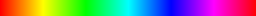

##### [start](https://github.com/mattdesl/lwjgl-basics/wiki) » LibGDX Textures
***

This is a mirror of the [OpenGL Textures](Textures) tutorial, but geared toward LibGDX users, and thus a little "higher level." After reading through this, it would be good to read the [OpenGL Textures](Textures) and [NIO Buffers](Java-NIO-Buffers) tutorials to better understand how LibGDX handles textures "under the hood."

### Primer: Digital Images

An image, as you may know, is simply an array of colors, rendered in two dimensions. Let's use this very small image as an example; a heart sprite and a half-heart sprite:   


Now, when we zoom in on the image in Photoshop or another program, we can clearly see how the image is constructed of individual pixels:    


There are a number of ways an image like this would be stored on a computer, most commonly [RGBA with 8-bits per channel](http://en.wikipedia.org/wiki/RGBA_color_space). `RGB` refers to the red, green and blue channels, and `A` refers to the alpha (transparency) channel. Below are three different ways of storing the colour red:

  * **Hex aka RGB int:** `#ff0000` or `0xff0000`
  * **RGBA byte:** `(R=255, G=0, B=0, A=255)`
  * **RGBA float:** `(R=1f, G=0f, B=0f, A=1f)`


The RGBA byte array representing the above image (32x16 px) might look something like this:
```java
new byte[ imageWidth * imageHeight * 4 ] {
    0x00, 0x00, 0x00, 0x00, //Pixel index 0, position (x=0, y=0), transparent black
    0xFF, 0x00, 0x00, 0xFF, //Pixel index 1, position (x=1, y=0), opaque red
    0xFF, 0x00, 0x00, 0xFF, //Pixel index 2, position (x=2, y=0), opaque red
    ... etc ...
}
```

As you can see, a single pixel is made up of four bytes. Keep in mind it's just a single-dimensional array! 

The size of the array is `WIDTH * HEIGHT * BPP`, where `BPP` (bytes per pixel) is in this case 4 (RGBA).
We will rely on the width in order to render it as a two-dimensional image.

Since an array of bytes can get very large, we generally use compression like PNG or JPEG in order to decrease the final file-size and distribute the image for web/email/etc.

### OpenGL Textures

In OpenGL, we use *textures* to store image data. OpenGL textures do not only store image data; they are simply float arrays stored on the GPU, e.g. useful for shadow mapping and other advanced techniques.

To create an OpenGL texture, we first need to "decode" the image format (PNG, JPEG, etc) into an array of color data, like we saw above. Then, we can "upload" the pixels to OpenGL, which is another way of saying: copy the pixel data from CPU (RAM) to GPU (VRAM). Typically this is a slow operation, so we only do it when necessary at the beginning of our program, or after GL context is lost (e.g. user pauses and resumes our game).

Typically, we load a texture in LibGDX like this:
```java
tex = new Texture(Gdx.files.internal("data/libgdx.png"));
```

The above decodes the `"data/libgdx.png"` image into a pixel array (Pixmap), then uploads the data to OpenGL (Texture) and discards the pixel array. The texture is "managed" by LibGDX, which means that it will be re-loaded if the OpenGL context is lost and regained (e.g. in an Android application, if the user hits the home button).

Here is a more explicit means of creating a texture. Note that this texture won't be "managed," so we will need to re-load it ourselves upon context loss.
```java
//decode the PNG into a pixel array, aka Pixmap
Pixmap pixels = new Pixmap("data/libgdx.png");

//if we wanted to, we could modify the pixel data before uploading it to GL
//...

//now we upload the data to GL by creating a new Texture
tex = new Texture(pixmap);

//and discard the pixels since we no longer need them
pixels.dispose();
```

We use `Pixmap` for handling image data on the CPU, aka "in software." We use `Texture` for handling the image data on GPU, aka "in hardware." 

To move the image data from CPU to GPU, we need to pass the pixmap to the `Texture` constructor, or "upload" the data with the `Texture.draw(..)` method:

```java
tex.draw(pixmap, x, y);
```

If you don't need to render your image to the screen, then there may be no need to use a `Texture` object. Instead, a simple `Pixmap` may do the trick. 

## LibGDX Formats

LibGDX will upload the data to OpenGL based on the format of the image being loaded. We can also specify formats explicitly, in which case LibGDX will perform conversions if necessary. Here is a brief explanation of the different formats in `Pixmap.Format`:

- `RGBA8888` - This is the format we described in the earlier *Primer* section. Each channel (R, G, B, A) is made up of a byte, or 8 bits. With this format, we have four bytes per pixel. We would use this for high-quality color that requires an alpha channel, for transparency. This is known as "True Color".
- `RGB888` - This is similar to the above, but discards the alpha channel (i.e. the image is opaque). This is useful for high-quality images that don't need an alpha channel.
- `RGBA4444` - This is similar to `RGBA8888`, but stores each channel in only 4 bits. This leads to lower color quality, but has performance and memory implications on low-end devices like Android and iOS. 
- `RGB565` - This stores the red channel in 5 bits, the green in 6 bits, and the blue in 5 bits. We use an extra bit in the green channel since the human eye can generally perceive more gradations of green. This is known as "High Color", and is again mainly useful for low-end or embedded devices.
- `LuminanceAlpha` - This is a grayscale image that includes an alpha channel. Grayscale colors have equal red, green and blue values, which we call "luminance." So a typical gray value of (R=127, G=127, B=127, A=255) would be represented like so with LuminanceAlpha: (L=127, A=255). Each uses 8 bits.
- `Alpha` - This is a special type of image that only stores an alpha channel in 8 bits.
- `Intensity` - This is another special type of image which only uses a single channel, but with the alpha channel equal to the luminance. For example, an Intensity color of (I=127) would be equivalent to a RGBA color of (R=127, G=127, B=127, A=127).

## Converting Formats

A quick and dirty method of "converting" a pixmap to the desired format might look like this:

```java
Format format = Format.RGBA8888; //desired format 

if (pix.getFormat()!=format) { //perform conversion if necessary
	Pixmap tmp = new Pixmap(pix.getWidth(), pix.getHeight(), format);
	tmp.drawPixmap(pix, 0, 0); //copy pix to tmp
	pix.dispose(); //dispose old pix
	pix = tmp; //swap values
}
//... now "pix" is RGBA8888 ...
```

## Drawing with Pixmaps

We can use Pixmaps for very simple render-to-texture functionality, done in software. For example, below we create a procedural brick texture:

```java
Pixmap px = new Pixmap(16, 16, Format.RGBA8888);
for (int x = 0; x < px.getWidth(); x++) {
	for (int y = 0; y < px.getHeight(); y++) {
		int brickHeight = 8;
		int brickWidth = 16;

		// starting x position
		int nx = x + brickWidth / 4;

		// offset nx every other row
		if ((y % brickHeight * 2) < brickHeight)
			nx += brickWidth / 2;

		// if inside mortar
		if (nx % brickWidth < 1 || y % (brickHeight / 2) < 1)
			px.setColor(Color.LIGHT_GRAY);
		// not inside mortar.. must be a brick
		else
			px.setColor(0.8f, 0.3f, 0.3f, 1f);

		// draw pixel
		px.drawPixel(x, y);
	}
}
```

Result (scaled 400%):  


Here is another example which procedurally draws a "hue slider" in software. 

```java
Pixmap px = new Pixmap(256, 16, Format.RGBA8888);
for (int x = 0; x < px.getWidth(); x++) {
	int rgb = HSBtoRGBA8888(x / (float)px.getWidth(), 1f, 1f);

	// change the current color
	px.setColor(rgb);

	// perform a fill operation with current color
	px.drawRectangle(x, 0, 1, px.getHeight());
}
```

Result:  


You can find the [HSBtoRGBA8888 method here](https://gist.github.com/mattdesl/5120985).

Generally speaking, it will be more efficient to load a pre-made texture (so it can be managed by LibGDX) or move these operations to the GPU (to take advantage of graphics hardware). We will examine how to do this in later series using [Shaders and GLSL](Shaders). With that said, you may run into specific cases where drawing in software will prove useful.

Another nice feature of LibGDX's Pixmap utilities is re-sampling images. So, if you wanted to down-scale an image from disk in software (e.g. in order to save it as a thumbnail), you could use the following:

```java
float scale = 0.25f; //25% of original size
Pixmap thumb = new Pixmap((int)(original.getWidth() * scale), (int)(original.getHeight() * scale), original.getFormat());
Pixmap.setFilter(Filter.BiLinear);
thumb.draw(original, 0, 0, original.getWidth(), original.getHeight(), 0, 0, thumb.getWidth(), thumb.getHeight());
```

The `setFilter` operation will be explained in more detail below. Note that it's static; as with Pixmap.setBlending, and affects all calls after it.

## Reading Pixmaps

One common usage for Pixmaps is to store data, for example a terrain map. The image isn't something that we need to render on screen, but instead is just something we use to create our 3D mesh. We can read the RGBA values of each pixel in a Pixmap like so:

```java
Pixmap pixmap = new Pixmap(Gdx.files.internal("img.png"));

Color color = new Color();

for (int x=0; x<pixmap.getWidth(); x++) {
    for (int y=0; y<pixmap.getHeight(); y++) {
        int val = pixmap.getPixel(x, y);
        Color.rgba8888ToColor(color, val);
        int R = (int)(color.r * 255f);
        int G = (int)(color.g * 255f);
        int B = (int)(color.b * 255f);
        int A = (int)(color.a * 255f);
    }
}
```

We could have instead decoded the RGBA8888 color like so:

```java
    int value = pixmap.getPixel(x, y);
    int R = ((value & 0xff000000) >>> 24);
    int G = ((value & 0x00ff0000) >>> 16);
    int B = ((value & 0x0000ff00) >>> 8);
    int A = ((value & 0x000000ff));
```

## Texture Parameters

After creating our Texture, we can use `setFilter` and `setWrap` to adjust its parameters. Here is an example:

```javq
texture.setFilter(Filter.Nearest, Filter.Nearest);
texture.setWrap(Texture.ClampToEdge, Texture.ClampToEdge);
```

#### Filtering 

The minification/magnification filters define how the image is handled upon scaling. For "pixel-art" style games, generally `Filter.Nearest` is suitable as it leads to hard-edge scaling without blurring. Specifying `Filter.Linear` will use bilinear scaling for smoother results, which is generally effective for 3D games (e.g. a 1024x1024 rock or grass texture) but not always so for a 2D game. In OpenGL, the terms used are `GL_NEAREST` and `GL_LINEAR`, respectively.   


With textures, we use `TextureFilter.Linear` and `TextureFilter.Nearest`. When rendering with pixmaps (i.e. in software), we can set the filter with `Filter.NearestNeighbour` and `Filter.BiLinear`, like so:
```java
Pixmap.setFilter(Filter.NearestNeighbour); //or Filter.BiLinear
pixmap.drawPixmap(... resample another pixmap ...);
```

#### Wrap Modes

To explain "texture wrap," we need to understand a bit more about *texture coordinates* and vertices. Let's take a simple two dimensional image, like the following brick texture:  


To render the above object, we need to give OpenGL four **vertices**. As you can see, we end up with a 2D quad. Each vertex has a number of attributes, including Position (x, y) and Texture Coordinates (s, t). Texture coordinates are defined in *tangent space*, generally between 0.0 and 1.0. These tell OpenGL where to sample from our texture data. Here is an image showing the attributes of each vertex in our quad:  


*Note:* This is a generalized overview; LibGDX actually uses a Y-up coordinate system and triangles instead of quads. We will get to these subjects later, when we work with custom Mesh objects.

Sometimes programmers and modelers use `UV` and `ST` interchangeably -- "UV Mapping" is another way to describe how textures are applied to a 3D mesh.

So what happens if we use texture coordinate values less than 0.0, or greater than 1.0? This is where the *wrap mode* comes into play. We tell OpenGL how to handle values outside of the texture coordinates. The two common modes in OpenGL ES are `TextureWrap.ClampToEdge`, which simply samples the edge color, and `TextureWrap.Repeat`, which will lead to a repeating pattern. For example, using 2.0 and `TextureWrap.Repeat` will lead to the image being repeated twice within the *width* and *height* we specified. In OpenGL, the terms used are `GL_CLAMP_TO_EDGE` and `GL_REPEAT`, respectively. Here is an image to demonstrate the differences between clamping and repeat wrap modes:


### Texture Atlases

One thing I haven't mentioned yet is the importance of texture atlases or "sprite sheets." Since we are only binding one texture at a time, this can be costly if we plan to draw many sprites or tiles per frame. Instead, it's almost always a better idea to place all of your tiles and sprites into a single image, so that you are only binding minimal textures per frame.

Here is one example of a texture atlas:  


As you might have noticed from the *Texture Wrap* section, we can tell OpenGL what part of our texture to render by specifying different texture coordinates. For example, say we want to render the grass tile at (1, 1), then texture coordinates would be set up like so:
```java
float srcX = 64;
float srcY = 64;
float srcWidth = 64;
float srcHeight = 64;

float u = srcX / tex.width;
float v = srcY / tex.height;
float u2 = (srcX + srcWidth) / tex.width;
float v2 = (srcY + srcHeight) / tex.height;
```

Here is a visual breakdown of each vertex:  


LibGDX actually has a number of utilities to help us with texture atlases. We could simplify the above with the following code:

```java
TextureRegion sprite = new TextureRegion(atlasTexture, 64, 64, 64, 64);
```

TextureRegion also includes a `split(..)` method to split up uniformly-sized atlases. The preferred method of handling sprite sheets in LibGDX is to use a [texture packer](https://code.google.com/p/libgdx-texturepacker-gui/), and load the TextureAtlas definition, and/or to pack textures on the fly with PixmapPacker (i.e. during runtime).

*Note:* As we discussed earlier, using `Filter.Linear` will lead to bilinear interpolation when scaling -- i.e. the nearest four pixels will be selected and blended together. This can lead to unwanted effects when scaling a texture atlas, where "bleeding" occurs at the edge of sprites, and so it's often wise to use `Filter.Nearest` and/or pad each sprite in your atlas with a transparent 1-2px border.


<a name="HardwareLimitations" />
## Hardware Limitations

### Max Texture Size

You can query the maximum texture width and height with the following:  
```java
IntBuffer buf = BufferUtils.newIntBuffer(16);
Gdx.gl.glGetIntegerv(GL10.GL_MAX_TEXTURE_SIZE, buf);
int maxSize = buf.get(0);
```

<sub>Read more about NIO buffers [here](Java-NIO-Buffers) -- note that LibGDX uses a slightly different BufferUtils class than LWJGL!</sub>

Generally, most modern computers allow for at least 4096x4096 textures, but if you want to be really safe, you can limit yourself to 2048x2048. If you are targeting Android, iOS, WebGL, or another OpenGL ES device, you might be safer sticking with 1024x1024 or less, unless you are absolutely sure of your target audience.

### Power of Two Sizes
One thing I have yet to note is the use of power-of-two (POT) dimensions. Historically, OpenGL only allowed POT texture dimensions:  
`1, 2, 4, 8, 16, 32, 64, 128, 256, 512, 1024, 2048, 4096... etc`

Today, however, most desktop drivers will support non-power-of-two (NPOT) texture sizes. Android should support NPOT with GLES 2.0+. You can check to see if your user supports NPOT textures with the following code:  
```java
boolean npotSupported = Gdx.graphics.supportsExtension("GL_OES_texture_npot") 
                  || Gdx.graphics.supportsExtension("GL_ARB_texture_non_power_of_two");
```

It should be noted that even if the driver does support NPOT textures, it's generally still advisable to stick to POT sizes as it will often lead to better performance and storage. And on some Android devices, NPOT textures may not render correctly, even though the device says it should work. (This may be due to a buggy driver, or a driver that only supported NPOT with limited filtering, no mipmapping, etc.)

## Realtime Per-Pixel Manipulation

So far we've seen how to render images in software (CPU) and upload them as textures (GPU), but this is not a viable solution for real-time rendering. If we tried doing this every frame, we would run into some serious performance problems, especially on Android. Often the solution is to use a shader to handle the per-pixel processing for you. You can read more about shaders in the [GLSL tutorial series](Shaders).