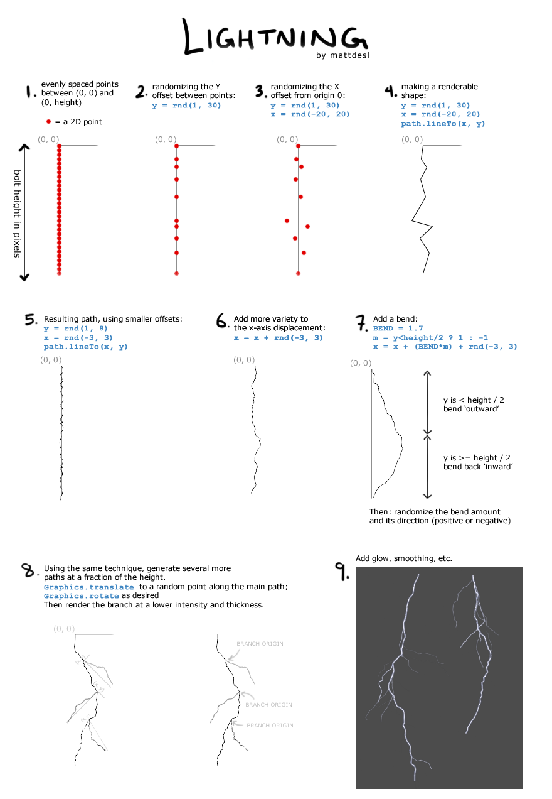

## Effects

If the graphics implementation (i.e. Java2D, HTML5 Canvas, etc) doesn't support glows, you can add it as a post-processing step.

Here is how it would be achieved in GLSL:  
[GLSL Gaussian Blur](http://www.gamerendering.com/2008/10/11/gaussian-blur-filter-shader/)

(Check out the [GLSL tutorials](https://github.com/mattdesl/lwjgl-basics/wiki/Shaders) if you're new to shaders)

Here is some very rough code for blurring in software (e.g. Java2D).

```java
public static final float[] weights = new float[] {
	0.05f, 0.09f, 0.12f, 0.15f,
	0.16f,
	0.15f, 0.12f, 0.09f, 0.05f
};

void blur(byte[] px, byte[] out) {
	//assuming type 4BYTE_ARGB
	
	//value between 0 and 255 to increase final output brightness
	final int brightness = 0;
	
	//horizontal blur
	for (int j=0; j<WIDTH*HEIGHT*4; j+=4) {			
		final int y = j/4 / WIDTH;
		final int x = j/4 - WIDTH*y;
		
		//this code only blurs the R channel, e.g. for grayscale alpha images
		//for RGBA you would need sumR, sumG, sumB
		int sumL = 0;
		int sumA = 0;
		for (int off=-4, idx=0; off<=4; off++, idx++) {
			int pxOff = off;
			if (x+pxOff < 0 || x+pxOff >= WIDTH)
				pxOff = 0; //CLAMP_TO_EDGE
			sumL += (buffer[j + pxOff*4 + 1] & 0xFF) * weights[idx];
			sumA += (buffer[j + pxOff*4 + 0] & 0xFF) * weights[idx] + 0.5f; //HACK: adding 0.5 to alpha fixes some transparency loss
		}
		byte sumLB =  (byte)Math.max(0, Math.min(255, sumL));
		
		buffer[j+1] = buffer[j+2] = buffer[j+3] = sumLB;
		//alpha
		buffer[j] = (byte)Math.max(0, Math.min(255, sumA));
	}
	
	//vertical blur
	for (int j=0; j<WIDTH*HEIGHT*4; j+=4) {			
		final int y = j/4 / WIDTH;
		final int x = j/4 - WIDTH*y;
		int sumL = 0;
		int sumA = 0;
		for (int off=-4, idx=0; off<=4; off++, idx++) {
			int pxOff = off;
			if (y+pxOff < 0 || y+pxOff >= HEIGHT)
				pxOff = 0; //CLAMP_TO_EDGE			
			pxOff *= WIDTH;
			sumL += (buffer[j + pxOff*4 + 1] & 0xFF) * weights[idx];
			sumA += (buffer[j + pxOff*4 + 0] & 0xFF) * weights[idx] + 0.5f; //HACK: adding 0.5 to alpha fixes some transparency loss
		}
		out[j+1] = out[j+2] = out[j+3] = (byte)Math.max(0, Math.min(255, sumL+brightness));
		out[j+0] = (byte)Math.max(0, Math.min(255, sumA));
	}
}
```