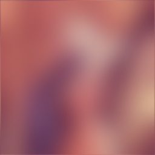
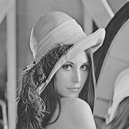
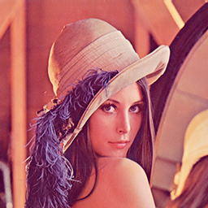
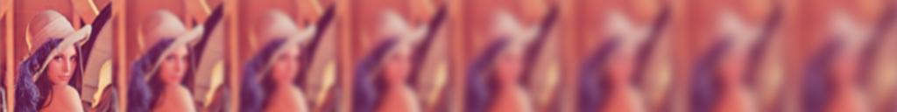
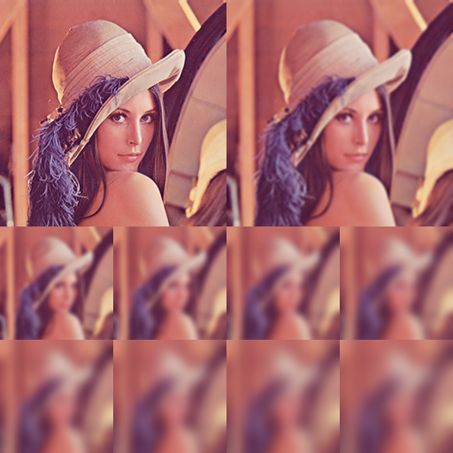
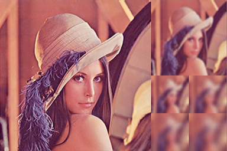
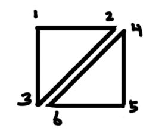

##### [start](https://github.com/mattdesl/lwjgl-basics/wiki) » [Shaders](Shaders) » [Lesson 5: Blurs](ShaderLesson5) » OpenGL ES Blurs

***

This article relies on [LibGDX](http://libgdx.badlogicgames.com/) for pixmap, shader and rendering utilities. The concepts should be universal enough that they could be applied to LWJGL, iOS, or any other platforms built on OpenGL. 

***

# Intro

Our blurring technique described in [Shader Lesson 5](ShaderLesson5) is fairly efficient on desktop, but won't hold up on more limited devices such as Android and iOS. This is largely because of the fill-rate and multiple passes involved.

By downsampling the frame buffer object to 50% of the screen size, we can achieve a frame rate of ~30 FPS on the Samsung Galaxy Tab II (7"). Another optimization is to use constants or varyings for our texture offsets, as described [here](http://xissburg.com/faster-gaussian-blur-in-glsl/) and implemented [here for iOS](https://github.com/BradLarson/GPUImage/blob/master/framework/Source/GPUImageFastBlurFilter.m). Yet another consideration is to sample _between_ texel centers, to exploit hardware filtering and reduce texture fetches: [see here](http://prideout.net/archive/bloom/#Sneaky).

This is not really acceptable, though, considering we'd like to target some lower end hardware, and even with these optimizations we'll have a hard time getting high performant rendering. Below we describe some other solutions for blurring on OpenGL ES.

### Contents

- [Software Blurring](#SoftwareBlur)
- ["Lerp Blur" - Faking Real-Time Blurs](#LerpBlur)
    - [Option A: Using Mipmaps and `bias`](#ImplementationA)
    - [Option B: Manual Lerp with `mix()`](#ImplementationB)
    - [Afterthought: GL_TEXTURE_3D](#GL_TEXTURE_3D)
    - [Bloom & Other Applications](#Bloom)

<a name="SoftwareBlur" />
# Software Blur

Modifying pixel data in software is slow since we need to transfer texture data to and from the GPU. This can lead to pipeline stalls, and generally isn't something you'd want to do every frame. However, if all we need is a fixed blur, or if our blur rarely ever changes, this may be a viable solution. Blurring in software also allows for a bit more flexibility, and we can employ a "true" gaussian blur or any other type of blur. This should work on all GL 1.0+ devices.

There are a number of blur algorithms floating around the web, here are a couple links:

- Mario Klingemann has a number of blur algorithms, including the popular [StackBlur](http://www.quasimondo.com/StackBlurForCanvas/StackBlurDemo.html) (ported for [Android](http://stackoverflow.com/questions/12198045/fast-variable-blur-or-blur-library-in-android))
- [Romain Guy's box blur in Java](http://www.java2s.com/Code/Java/Advanced-Graphics/FastBlurDemo.htm)
- [Basic box blur](http://www.blackpawn.com/texts/blur/default.html)

I have implemented Romain Guy's box blur for LibGDX in the following utility class:

[BlurUtils](https://gist.github.com/4383372)

Note that this utility isn't very performant -- it requires a lot of unnecessary data copies from ByteBuffer to int[] and back. A more involved solution would be to blur a RGB or RGBA ByteBuffer directly; however, for the purpose of our small demo, it runs fast enough, and is only used at creation time.

### BlurUtils Usage

After decoding the image into a Pixmap, we can blur the pixel buffer with the BlurUtils class. Then we can upload the blurred pixels to a GL texture.

```java
//load original pixmap
Pixmap orig = new Pixmap(Gdx.files.internal("data/lenna.png"));

//Blur the original pixmap with a radius of 4 px
//The blur is applied over 2 iterations for better quality
//We specify "disposePixmap=true" to destroy the original pixmap
Pixmap blurred = BlurUtils.blur(orig, 4, 2, true);

//we then create a GL texture with the blurred pixmap
blurTex = new Texture(blurred);

//dispose our blurred data now that it resides on the GPU
blurred.dispose();
```

The result, using the notorious [Lenna](http://en.wikipedia.org/wiki/Lenna):    


Note that the resulting texture is not managed, so you will have to re-load it using the above code after GL context loss.

<a name="LerpBlur" />
# "Lerp Blur" - Faking Real-Time Blurs

The software solution above only gives us a single blur strength to work with. If we wanted to use a different blur strength, we would need to blur the original image again, then re-upload the newly blurred pixmap data. This is very costly and would destroy our framerate if done frequently. 

Below I describe a trick to achieve blurs of varying strengths without much impact on rendering performance, especially suitable for mobile devices and low-end hardware. The idea is to "lerp" (linearly interpolate) between different pre-calculated blur strengths, hence the name. I have not found much written on this technique, although I'm surely not the first to try it.

We'll look at two different means of implementing the effect:

- [Option A: Using Mipmaps and `bias`](#ImplementationA)
- [Option B: Manual Lerp with `mix()`](#ImplementationB)

<a name="ImplementationA" />
## Option A: Using Mipmaps

You can follow along with source code here: [LerpBlurA.java](https://gist.github.com/4401290). It requires the [BlurUtils](https://gist.github.com/4383372) class mentioned earlier, and uses [this](images/X0NET.png) Lenna image.

_Note:_ I'll assume you understand the basics of mipmapping. If not, [read up on them](http://en.wikipedia.org/wiki/Mipmap) before continuing. 

An old-school trick for cheap blurs is to down-sample your image with high quality interpolation (such as those employed by most drivers for mip-mapping), and then up-scale the image with linear filtering. 


Downscaled to 64x64, upscaled to 256x256. Looks pretty crappy. Now, let's do the above, but after downsampling to 64x64, we'll apply a nice quality gaussian blur to the downsized image. Rendered at 256x256:



Holy shiza, it looks like a blur. The code for that:

```java
Pixmap orig = new Pixmap(Gdx.files.internal("data/lenna.png"));

int origWidth = orig.getWidth();
int origHeight = orig.getHeight();

//blur parameters
int blurRadius = 4;
int iterations = 3;

//blur the image at 25% of original size
//also specify disposePixmap=true to dispose the original Pixmap
Pixmap blurred = BlurUtils.blur(orig, 0, 0, origWidth, origHeight,
						0, 0, origWidth/4, origHeight/4,
						blurRadius, iterations, true);
					
//uplaod the blurred texture to GL
tex = new Texture(blurred);
tex.setFilter(TextureFilter.Linear, TextureFilter.Linear);
tex.setWrap(TextureWrap.Repeat, TextureWrap.Repeat);

//dispose blur after uploading
blurred.dispose();

//... then render tex with size origWidth, origHeight ...
```

Now, maybe you can see how mipmaps would help us here. The further we downscale, the stronger the blur will appear. Each successive downsample in our mipmap chain acts as the next level up in "blur strength." Our effect only works if we generate custom mipmaps, though, as we need to blur at each mipmap level after downsampling. Here is the set up code:

```java
//load the original image, can be in any format
Pixmap pixmap = new Pixmap(Gdx.files.internal("data/lenna.png"));

//upload the (unblurred) data, this will be put to mipmap level 0
//NOTE: we need to ensure RGBA8888 format is used, otherwise it may not render correctly
tex = new Texture(pixmap, Format.RGBA8888, false);

//bind before we generate mipmaps
tex.bind();

//generate our blurred mipmaps
BlurUtils.generateBlurredMipmaps(pixmap, pixmap.getWidth(), pixmap.getHeight(), 1, 3, true);

//clamping to edge seems to work best
tex.setWrap(TextureWrap.ClampToEdge, TextureWrap.ClampToEdge);

//any mipmap filter setting will work; but this will give us the smoothest result
tex.setFilter(TextureFilter.MipMapLinearLinear, TextureFilter.MipMapLinearLinear);
```

*Note:* If a texture is invalidated from context loss, we can re-upload Pixmap data with `texture.draw(Pixmap, x, y)`.

The `generateBlurredMipmaps` essentially just draws successively halved Pixmaps, then applies a software blur on them, then uploads the Pixmap data to that mipmap level with the following:
```java
//upload Pixmap to currently bound texture 
Gdx.gl.glTexImage2D(GL10.GL_TEXTURE_2D, mipmapLevel,
		pixmap.getGLInternalFormat(), pixmap.getWidth(),
		pixmap.getHeight(), 0, pixmap.getGLFormat(),
		pixmap.getGLType(), pixmap.getPixels());
```

Then, on the GLSL side, we'll use the optional `bias` parameter of `texture2D`, which allows us to influence which mipmap level we sample from. Depending on the given bias, the driver will choose the most appropriate mipmap level. With MipMapLinearLinear, we actually end up with "trilinear" filtering, where the driver interpolates between the two nearest mipmap levels. 

```glsl
...

//bias to influence LOD picking; e.g. "blur strength"
uniform float bias;

void main() {
	//sample from the texture using bias to influence LOD
	vec4 texColor = texture2D(u_texture, vTexCoord, bias);
	gl_FragColor = texColor * vColor;
}
```



<sup>(Shown in grayscale for better GIF quality)</sup>

You can also play with the texture filter. MipMapNearestLinear leads to an interesting pixelated effect. MipMapLinearNearest leads to a "stepping" effect between mipmap levels, but with smooth interpolation. MipMapNearestNearest leads to both a "stepping" and pixelated effect.

The upsides to this solution is that we only need to set it up once, then we can forget about it. It also works with SpriteBatch, so it doesn't require very much refactoring. The downside is that `bias` is not a commonly used or well tested feature, thus may not act as expected on certain drivers. It also seems rather arbitrary how much our maximum bias should be. Another obvious downside is that this solution requires 33% more texture space.

You might also notice the transition from mipmap 0 (unblurred) to 1 (blurred slightly) looks a little strange. This is because the difference between the two is so dramatic -- full size unblurred to half-size blurred. If you need a smoother blur transition, you can try playing with the blur radius at varying mipmap levels, or you can try Implementation B, which attempts to fix this problem.

_Note:_ This solution would also be possible to employ on GL 1.0 devices, using `GL_TEXTURE_LOD_BIAS`, `GL_TEXTURE_MIN_LOD` and `GL_TEXTURE_MAX_LOD`.

<a name="ImplementationB" />

## Option B: Manual Lerping with `mix()`

You can follow along with the source code here: [LerpBlurB.java](https://gist.github.com/4401311)
It requires the [BlurUtils](https://gist.github.com/4383372) class mentioned earlier, and uses [this](images/X0NET.png) Lenna image.

Another solution is create multiple textures of varying blur strengths, and "linearly interpolate" between them while rendering to mimic realtime blurring. This doesn't require the `bias` parameter (which is not thoroughly tested), and allows for a slightly smoother transition from unblurred to blurred.

Given our original texture:  


We would create an array of increasingly blurry images, like so:



Notice that each is half the size of our original; this "downsampling" reduces memory usage, and the differences will be minor when we upscale with linear filtering. Since we're working on phones and small screens, we could probably get away with even further downsampling.

To fake the real-time blurring, we use `mix()` in GLSL to lerp between two different blur strengths. It looks like this:


<sup>(Shown in grayscale for better GIF quality)</sup>

There are a number of ways we could implement this in practice. One would be to layout your sprites along a single column in your sprite sheet, and have the successive blur strengths placed to the right of each respective sprite. Then the shader would offset the S (i.e. x-axis) texture coordinate based on the desired blur strength.

Instead, we'll use another solution to demonstrate how to work with a custom mesh and pass our own attributes to a shader. The downside is that we won't be able to use SpriteBatch. In future, LibGDX will likely use abstraction to support custom batches and renderers, or provide some other means of plugging in generic vertex attributes.

Firstly, decode our image into a Pixmap. Then we need to build a larger pixmap, made up of our image at varying sizes and blur strengths. Here are two ideas for laying out your sheet, although you can use your own layout that suits your needs:





The first layout leads to a smoother and wider transition of blurs, while the second uses less texture space. Note that the second layout uses a non-power-of-two texture width, which may be a problem for various devices (e.g. Samsung Tab II does not seem to support NPOT very well).

The [code for the layout](https://gist.github.com/4401311#file-lerpblurb-java-L260) setup looks long and frightening, but actually it's just a series of simple 2D graphics operations with Pixmap. Those familiar with Java2D or any other image rendering API will have no trouble with this spot.

After creating our "blur map" and texture regions, we need to set up our shaders. Since we aren't using SpriteBatch, we need to explicitly pass the `u_texture` and `u_projTrans` uniforms. This is not much different than previous lessons. The next step, however, is a bit new:

```java
//mesh of our sprite; holds a single "quad" made up of two triangles
mesh = new Mesh(false, 4 * 6, 6, new VertexAttribute(Usage.Position, 2, ShaderProgram.POSITION_ATTRIBUTE),
								 new VertexAttribute(Usage.TextureCoordinates, 2, ShaderProgram.TEXCOORD_ATTRIBUTE+"0"),
								 new VertexAttribute(Usage.TextureCoordinates, 2, ShaderProgram.TEXCOORD_ATTRIBUTE+"1"));

// we send the following attributes: Position, TexCoord0, and TexCoord1
// vertices are laid out like so: { x, y, u, v, u2, v2 }
verts = new float[6*4]; // 4 vertices per "quad" and 6 attributes

// we use element indices to reduce the number of vertices we send to the GPU
mesh.setIndices(new short[] {
	0, 1, 2, 
	2, 3, 0
});
```

As explained in the [Sprite Batching](Sprite-Batching) tutorial, we need to pass data as `GL_TRIANGLES`, not quads. See the image for reference:  


As we can see, there are some repeating elements in our image. This is why we use "vertex indices". This way, we only need to pass 4 vertices when giving the data to the GPU, and OpenGL will evaluate it to 6 vertices to make up our triangles.

Our system will be rather simple: give our shader two different TextureRegions, and how much to interpolate from A to B. It looks like this:
```glsl
#ifdef GL_ES
precision mediump float;
#endif
varying vec2 vTexCoordA;
varying vec2 vTexCoordB;
uniform sampler2D u_texture;
uniform float lerp;

void main() {
	//sample the two texture regions
	vec4 texColorA = texture2D(u_texture, vTexCoordA);
	vec4 texColorB = texture2D(u_texture, vTexCoordB);
	
	//lerp between them
	gl_FragColor = mix(texColorA, texColorB, lerp);
}
```

To draw our Mesh, we need to define our vertices (position, texture coordinates) before rendering:
```java
void draw(int x, int y, int width, int height, float blurStrength) {
	//get integer (i.e. index of blur texture region)
	int iblurStrength = (int)blurStrength;
	//get fractional (i.e. amount to mix between the two regions)
	float lerp = blurStrength - iblurStrength;
	TextureRegion A, B;
	if (iblurStrength<=0) {
		//make both texcoords the same
		A = B = blurs[0];
	} else {
		//the previous strength
		A = blurs[iblurStrength-1];
		//the current strength
		B = blurs[iblurStrength];
	}
	int idx = 0;
	//bottom left
	verts[idx++] = x;
	verts[idx++] = y;
	verts[idx++] = A.getU();
	verts[idx++] = A.getV2();
	verts[idx++] = B.getU();
	verts[idx++] = B.getV2();
	
	//top left
	verts[idx++] = x;
	verts[idx++] = y + height;
	verts[idx++] = A.getU();
	verts[idx++] = A.getV();
	verts[idx++] = B.getU();
	verts[idx++] = B.getV();
	
	//top right
	verts[idx++] = x + width;
	verts[idx++] = y + height;
	verts[idx++] = A.getU2();
	verts[idx++] = A.getV();
	verts[idx++] = B.getU2();
	verts[idx++] = B.getV();
	
	//bottom right
	verts[idx++] = x + width;
	verts[idx++] = y;
	verts[idx++] = A.getU2();
	verts[idx++] = A.getV2();
	verts[idx++] = B.getU2();
	verts[idx++] = B.getV2();
	
	//set the vertices to the above
	mesh.setVertices(verts);
	
	//bind our blur map texture
	blurMap.bind();
	
	//begin our shader and set the "lerp" value
	shader.begin();
	shader.setUniformf("lerp", lerp);
	
	//render our mesh with the shader
	mesh.render(shader, GL10.GL_TRIANGLES);
	shader.end();
}
```

As you can see, this implementation requires a little more setup, more texture space, and doesn't allow us to take advantage of SpriteBatch in LibGDX. However, if you are running into issues with the `bias` parameter on particular drivers, or if you need a slightly more accurate blur between different strengths, this technique may be more appropriate.

<a name="GL_TEXTURE_3D" />
## Afterthought: GL_TEXTURE_3D

_In theory_, GL_TEXTURE_3D is an ideal candidate for our Lerp Blur, especially because it interpolates _between_ different textures. Unfortunately, it has two major drawbacks: first, it's hardly supported on Android and OpenGL ES, and second, it does not allow for the flexibility of image size that our earlier techniques do. However, it still may be a viable solution for desktop (if typical two-pass GLSL blurs are not an option).

<a name="Bloom" />
## Bloom & Other Applications

As described in [ShaderLesson5](ShaderLesson5), a bloom is achieved by blurring [only the bright areas](http://www.curious-creature.org/2007/02/20/fast-image-processing-with-jogl/) of a scene and rendering it back with screen or add blending. This would be straight-forward with our above solutions, since our fragment shader can sample both the blurred and non-blurred regions.

We can also apply some of the ideas we learned in earlier lessons. For example, we could create a vignette blur by using a [circle or oval](ShaderLesson3) as the third parameter to `mix`, having it increase in strength as we move away from the center.

We could also use the "texture splat" techniques in [Lesson 4](ShaderLesson4) to blur the image based on a separate depth map; similar to Photoshop's Lens Blur filter.