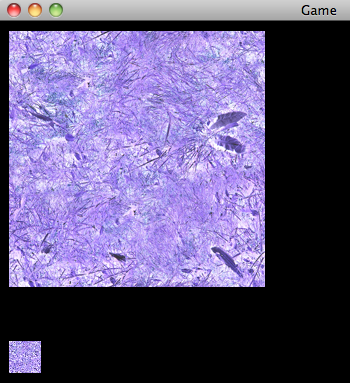
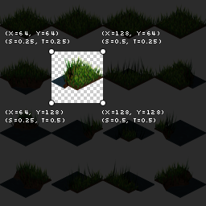
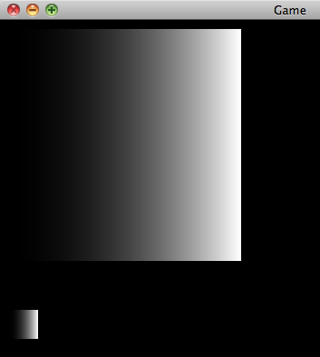
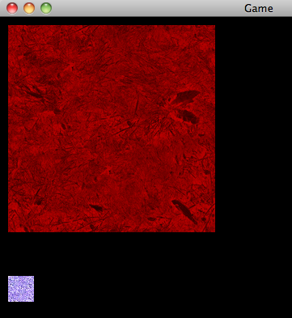

##### [start](https://github.com/mattdesl/lwjgl-basics/wiki) » [Shaders](Shaders) » Lesson 2: Texture Sampling

***

This series relies on the minimal [lwjgl-basics](https://github.com/mattdesl/lwjgl-basics) API for shader and rendering utilities. The code has also been [Ported to LibGDX](#Ports). The concepts should be universal enough that they could be applied to [Love2D](https://love2d.org/), [GLSL Sandbox](http://glsl.heroku.com/), iOS, or any other platforms that support GLSL. 

***

## Setup

In this lesson we'll learn how to sample from a texture and invert its colours, similar to Photoshop's Invert Color function.

Follow along with the full source code [here](https://github.com/mattdesl/lwjgl-basics/blob/master/test/mdesl/test/shadertut/ShaderLesson2.java). Our set up looks exactly the same as in [Lesson1](ShaderLesson1), except that we are loading different shaders.

We can leave our rendering method the same, and now we'll see a different outcome:



(The original grass texture can be seen [here](https://github.com/mattdesl/lwjgl-basics/blob/master/test/res/grass.png).)


## The Shaders

Here is the [vertex shader](https://github.com/mattdesl/lwjgl-basics/blob/master/test/res/shadertut/lesson2.vert):
```glsl
//combined projection and view matrix
uniform mat4 u_projView;

//"in" attributes from our SpriteBatch
attribute vec2 Position;
attribute vec2 TexCoord;
attribute vec4 Color;

//"out" varyings to our fragment shader
varying vec4 vColor;
varying vec2 vTexCoord;
 
void main() {
	vColor = Color;
	vTexCoord = TexCoord;
	gl_Position = u_projView * vec4(Position, 0.0, 1.0);
}
```

The above is a simple "pass through" vertex shader. It does two things:

1. Pass the `Color` and `TexCoord` attributes along to our fragment shader.
2. Transform the given screen space position into 3D world-space coordinates that OpenGL understands (same as in Lesson 1).

And the [fragment shader](https://github.com/mattdesl/lwjgl-basics/blob/master/test/res/shadertut/lesson2.frag):
```glsl
//SpriteBatch will use texture unit 0
uniform sampler2D u_texture;

//"in" varyings from our vertex shader
varying vec4 vColor;
varying vec2 vTexCoord;

void main() {
	//sample the texture
	vec4 texColor = texture2D(u_texture, vTexCoord);
	
	//invert the red, green and blue channels
	texColor.rgb = 1.0 - texColor.rgb;
	
	//final color
	gl_FragColor = vColor * texColor;
}
```

Our fragment shader is also pretty simple:

1. Sample the color at the current texture coordinate. 
2. Invert the RGB components of the texture color.
3. Multiply this color by our vertex color and "output" the result.


## Vertex Shader

As in Lesson 1, we declare a `Position` attribute, but also a `TexCoord` and `Color` attribute. These are given to us from our SpriteBatch, and are read-only in GLSL.
```glsl
//"in" attributes from our SpriteBatch
attribute vec2 Position;
attribute vec2 TexCoord;
attribute vec4 Color;
```

The `TexCoord` attribute depends on which region of a texture we are rendering. If we are rendering the texture fully, generally tex coords `[0.0 - 1.0]` will be used. If we were rendering a "sub image" of our texture with `drawRegion`, the tex coords will be much different. Custom tex coords can be given to SpriteBatch if we, say, wanted to repeat a texture using `GL_REPEAT`. Since each vertex only uses 2 texture coordinates `(s, t)`, we use a `vec2`.

The `Color` attribute is set from Java with `SpriteBatch.setColor`, and it can be useful for tinting sprites or changing their transparency. Generally all vertices of a single sprite will use the same `Color` attribute; however, you could specify different values for each vertex in order to, say, have a sprite fade out from left to right. Most often, the `Color` attribute will be opaque white `(R=1, G=1, B=1, A=1)` in order to render our sprites with 100% opacity. To store the `(r, g, b, a)` components, we use a `vec4`.

In order for the fragment shader to utilize these attributes, we need to "pass them along." This is done by declaring **varyings** in the vertex and fragment shaders. In the vertex shader, we pass them along like so:
```glsl
...

//passing values "out" to the fragment shader
varying vec2 vTexCoord; //a vec2 for ST
varying vec4 vColor; //a vec4 for RGBA

void main() {
    vTexCoord = TexCoord;
    vColor = Color;
    ...
}
```

Our varying names can be anything, as long as they are consistent between fragment and vertex shaders.

## Fragment Shader

Before we can sample our texture, we need to know which texture unit we are sampling from. For this we use the following:

```glsl
uniform sampler2D u_texture;
```

As I briefly explained in the [Texture](Textures) tutorial, it's possible in OpenGL to have multiple active texture units (i.e. multiple textures "bound" at once). We use a `sampler2D` to know which to sample from. However, for now, we will only concern ourselves with the default texture unit zero (`GL_TEXTURE0`). We can think of `sampler2D` as an `int` type, where `0` is the default texture unit. 

SpriteBatch will look for a `sampler2D` uniform named `u_texture` (or `SpriteBatch.U_TEXTURE`). SpriteBatch will then set this uniform for us to `0`, during initialization, to indicate the default texture unit.

Again, since uniforms and attributes are read-only in GLSL, we cannot assign them a value from within our shaders.

As we can see in the fragment shader, we also need to declare our varyings, i.e. our attributes passed from the vertex shader. The names should match the varyings we declared in the vertex shader.

```glsl
//"in" attributes from vertex shader
varying vec4 vColor;
varying vec2 vTexCoord;
```

### Texture Sampling

Remember that the vertex shader works on every vertex, and the fragment shader works on every fragment (or "pixel"). So our fragment shader's `main()` method is being used on every pixel within the `width` and `height` we specified to `SpriteBatch.draw`.

However, as we can see in the following image from our [Textures](Textures) tutorial, the texture coordinates are only specified _per-vertex_:



For fragments _within_ those vertices, the `TexCoord` value (as well as other attributes, like vertex `Color`) is interpolated based on the relative distances of the vertices to that fragment. We can test this by outputting `TexCoord.s` (i.e. the x-axis texture coordinate) as the fragment color:

```glsl
//use TexCoord.s for RGB, then 1.0 for alpha
gl_FragColor = vec4(vec3(vTexCoord.s), 1.0);
```

If we were to then draw the full texture with texcoords `[0.0 - 1.0]`, we would see the following:



As we can see, the value is interpolated from `0.0` (black, on left) to `1.0` (white, on right), resulting in a gradient.

To sample our texture at the current fragment, we use the following method:

```glsl
vec4 texColor = texture2D(u_texture, vTexCoord);
```

The `texture2D` method expects a `sampler2D` for the first argument (i.e. to know which texture unit to sample from), and a `vec2` for the second argument (texture coordinates `st`). It returns a `vec4` with the RGBA for that sample. 

If we are using `GL_NEAREST`, the colour will be sampled by picking the [nearest-neighbour](http://en.wikipedia.org/wiki/Nearest-neighbor_interpolation) pixel at the given texture coordinates. If we are using `GL_LINEAR`, the sampled colour will be the nearest _four_ pixel colours, blended with a weighted average (i.e. [bilinear interpolation](http://en.wikipedia.org/wiki/Bilinear_interpolation)).

Now, we could output the `texColor` to `gl_FragColor` in order to see the regular texture colour. However, for the sake of doing something cool, let's try inverting the colour. Keep in mind that RGBA is generally normalized to `[0.0 - 1.0]` (where 0.0 is black, and 1.0 is white). So we can use the following to invert the RGB values, and leave the alpha component unchanged:
```glsl
//invert the red, green and blue channels
texColor.rgb = 1.0 - texColor.rgb;
```

Lastly, for our final colour, we'll multiply the texture colour by the vertex colour. This allows us to use `SpriteBatch.setColor` to tint the RGB of a sprite, and/or change its transparency. Using pure white (the default SpriteBatch colour) will have no effect, since we are multiplying the RGBA by `1.0`.

```glsl
gl_FragColor = texColor * vColor;
```

We can test this by changing our application's rendering code to the following:
```java
protected void render() throws LWJGLException {
	super.render();

	// start our batch
	batch.begin();

	//SpriteBatch will use the same color for each vertex
	
	//alpha set to 75% opacity
	//multiply RGB by (1, 0, 0)
	batch.setColor(1f, 0.0f, 0.0f, 0.75f);
	batch.draw(tex, 10, 10);

	//pure white; i.e. unchanged
	batch.setColor(1f, 1f, 1f, 1f);
	batch.draw(tex, 10, 320, 32, 32);

	// end our batch
	batch.end();
}
```

We can see the result of that here:  


## On to Lesson 3

Check out [Lesson 3](ShaderLesson3) or go back to the [shaders intro](Shaders).

<a name="Ports" />
## Other APIs

Grab the `grass.png` texture [here](https://raw.github.com/mattdesl/lwjgl-basics/master/test/res/grass.png).

  * [Ported to LibGDX](https://gist.github.com/4247043)