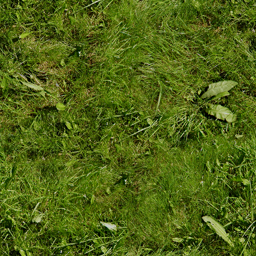
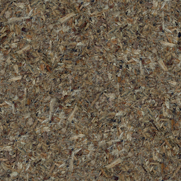
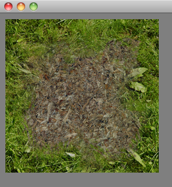
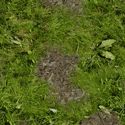

##### [start](https://github.com/mattdesl/lwjgl-basics/wiki) » [shaders](Shaders) » Lesson 4: Multiple Texture Units

***

This series relies on the minimal [lwjgl-basics](https://github.com/mattdesl/lwjgl-basics) API for shader and rendering utilities. The code has also been [Ported to LibGDX](#Ports). The concepts should be universal enough that they could be applied to [Love2D](https://love2d.org/), [GLSL Sandbox](http://glsl.heroku.com/), iOS, or any other platforms that support GLSL. 

***

# Setup

You can see the source for this short demo [here](https://github.com/mattdesl/lwjgl-basics/blob/master/test/mdesl/test/shadertut/ShaderLesson4.java). The setup looks a lot like previous lessons, with a couple minor differences. First, we load the following three textures:

 
 


Second, we are setting our uniforms after creating the program, like so:

```java
//create our shader program -- be sure to pass SpriteBatch's default attributes!
program = new ShaderProgram(VERTEX, FRAGMENT, SpriteBatch.ATTRIBUTES);

//Good idea to log any warnings if they exist
if (program.getLog().length()!=0)
	System.out.println(program.getLog());

//bind our program
program.use();

//set our sampler2D uniforms
program.setUniformi("u_texture1", 1);
program.setUniformi("u_mask", 2);
```

(Keep in mind that the uniforms `u_texture` and `u_projView` will be set from SpriteBatch.)

And thirdly, we are binding our textures into different texture units, like so:
```java
//make GL_TEXTURE2 the active texture unit, then bind our mask texture
glActiveTexture(GL_TEXTURE2);
mask.bind();

//do the same for our dirt texture
glActiveTexture(GL_TEXTURE1);
tex1.bind();

//don't forget to set active texture unit back to GL_TEXTURE0 !
glActiveTexture(GL_TEXTURE0);
tex0.bind();
```

`glActiveTexture` specifies the texture unit to use, and `bind()` will bind that texture to the current texture unit. The numbers will line up with the sampler2D uniforms we specified to our fragment shader: e.g. `program.setUniform("u_texture1", 1) => GL_TEXTURE1`. 

It's important to remember that OpenGL is a state-based API. So if you make `GL_TEXTURE1` the active texture, and forget to reset to `GL_TEXTURE0` before trying to render, you may run into problems.

Our [vertex shader](https://github.com/mattdesl/lwjgl-basics/blob/master/test/res/shadertut/lesson4.vert) is the same as in the previous lesson. Here is our [fragment shader](https://github.com/mattdesl/lwjgl-basics/blob/master/test/res/shadertut/lesson4.frag):

```glsl
//"in" attributes from our vertex shader
varying vec4 vColor;
varying vec2 vTexCoord;


//our different texture units
uniform sampler2D u_texture; //default GL_TEXTURE0, expected by SpriteBatch
uniform sampler2D u_texture1; 
uniform sampler2D u_mask;

void main(void) {
	//sample the colour from the first texture
	vec4 texColor0 = texture2D(u_texture, vTexCoord);

	//sample the colour from the second texture
	vec4 texColor1 = texture2D(u_texture1, vTexCoord);

	//get the mask; we will only use the alpha channel
	float mask = texture2D(u_mask, vTexCoord).a;

	//interpolate the colours based on the mask
	gl_FragColor = vColor * mix(texColor0, texColor1, mask);
}
```



Note that we are limited by the maximum number of "texture image units" -- we can check with the following:
```java
int maxUnits = glGetInteger(GL_MAX_TEXTURE_IMAGE_UNITS);
```

Most drivers support [up to 16](http://feedback.wildfiregames.com/report/opengl/feature/GL_MAX_TEXTURE_IMAGE_UNITS_ARB) active units. However, if you need that many active texture units, you may need to re-think your design.

This doesn't cover much new ground<sup>(pun!)</sup>, but you'll want to be comfortable with multiple texture units before moving onto other advanced topics.

In a 3D game, texture splatting like this may be useful since it can be applied over the entire terrain, which may be made up of tiled grass/dirt/etc. textures. For a 2D game, this kind of texture splatting isn't really necessary, and it would have been better to just save the blended result as a new image (preferably packed into a texture atlas). However, there are some applications for this even in 2D, for example, if we were to modulate the mask (or one of the textures) which would require us to do the blending in real-time:



The above example uses [simplex noise](https://github.com/ashima/webgl-noise/wiki) to modulate the texture coordinates before sampling from the mask. It would be a particularly cool way to blend water and land textures in a wave-like motion. You can test this with the [ShaderLesson4B code](https://github.com/mattdesl/lwjgl-basics/blob/master/test/mdesl/test/shadertut/ShaderLesson4B.java).

## Lesson 5

Move on to [Lesson 5](https://github.com/mattdesl/lwjgl-basics/wiki/ShaderLesson5) or back to [the contents](Shaders).

<a name="Ports" />
## Other APIs

Grab the `grass.png`, `dirt.png` and `mask.png` from [here](https://github.com/mattdesl/lwjgl-basics/tree/master/test/res).

  * [Lesson4](https://gist.github.com/4342861) and [Lesson4B](https://gist.github.com/4342846) ported to LibGDX