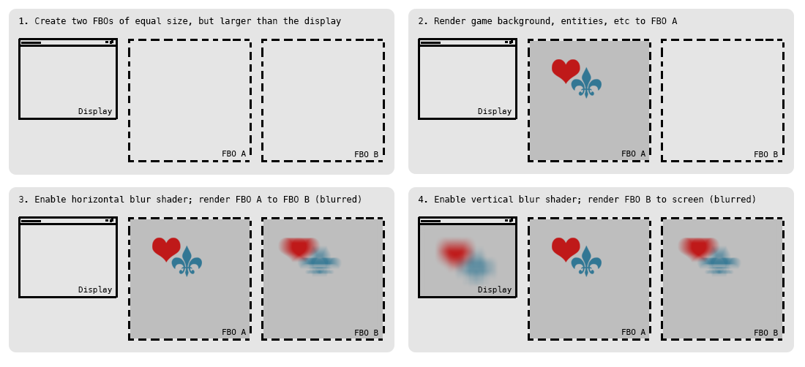
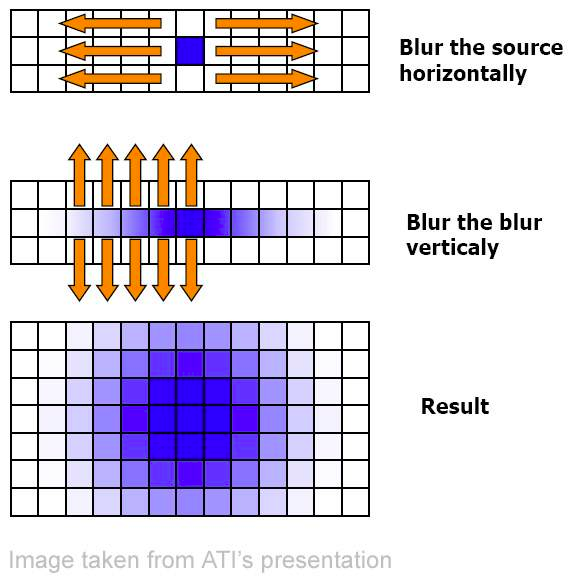
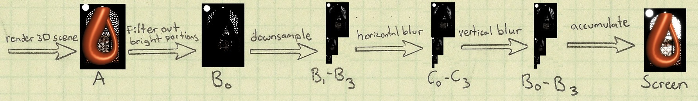
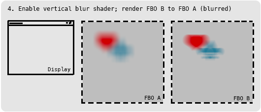

##### [start](https://github.com/mattdesl/lwjgl-basics/wiki) » [Shaders](Shaders) » Lesson 5: Blurs

***

This series relies on the minimal [lwjgl-basics](https://github.com/mattdesl/lwjgl-basics) API for shader and rendering utilities. The code has also been [Ported to LibGDX](#Ports). The concepts should be universal enough that they could be applied to [Love2D](https://love2d.org/), [GLSL Sandbox](http://glsl.heroku.com/), iOS, or any other platforms that support GLSL. 

***

## Setup

This lesson requires understanding the Frame Buffer Object (FBO), so [read up on them](FrameBufferObjects) if you haven't already. Also ensure you are well-versed on the basics of [sprite batching](Sprite-Batching).

The lesson will demonstrate a [gaussian blur](http://en.wikipedia.org/wiki/Gaussian_blur) technique in GLSL inspired by [this article](http://www.gamerendering.com/2008/10/11/gaussian-blur-filter-shader/). The blur is applied in two passes -- horizontally and vertically -- however, our implementation will only require a single fragment shader. 

Here is a visual overview of the two-pass blurring process:

<a name="Overview" />




You can follow along with the source [here](https://github.com/mattdesl/lwjgl-basics/blob/master/test/mdesl/test/shadertut/ShaderLesson5.java). First, we load some textures, then we go on to create our frame buffers:

```java
//create our FBOs
blurTargetA = new FrameBuffer(FBO_SIZE, FBO_SIZE, Texture.LINEAR);
blurTargetB = new FrameBuffer(FBO_SIZE, FBO_SIZE, Texture.LINEAR);
```

We use a square power-of-two size for simplicity as well as maximum compatibility, and take advantage of linear filtering for a smoother blur. I am using `1024` which should encompass most display sizes, but if you plan to support larger resolutions you may need a larger buffer. Keep in mind that we are limited by the maximum texture size. 

Next, we load our shader, print any potential warnings, and setup some default uniform values:

```java
//our basic pass-through vertex shader
final String VERT = Util.readFile(Util.getResourceAsStream("res/shadertut/lesson5.vert"));

//our fragment shader, which does the blur in one direction at a time
final String FRAG = Util.readFile(Util.getResourceAsStream("res/shadertut/lesson5.frag"));

//create our shader program
blurShader = new ShaderProgram(VERT, FRAG, SpriteBatch.ATTRIBUTES);

//Good idea to log any warnings if they exist
if (blurShader.getLog().length()!=0)
	System.out.println(blurShader.getLog());

//always a good idea to set up default uniforms...
blurShader.use();
blurShader.setUniformf("dir", 0f, 0f); //direction of blur; nil for now
blurShader.setUniformf("resolution", FBO_SIZE); //size of FBO texture
blurShader.setUniformf("radius", radius); //radius of blur
```

The `dir` uniform will be a `vec2` defining which direction to blur along. `(1.0, 0.0)` represents the X-axis, and `(0.0, 1.0)` represents the Y-axis. The `resolution` will be used to determine the pixel size in the fragment shader, so we need to give it the `FBO_SIZE`. The last uniform, `radius`, determines the strength of the blur.

Lastly, we set up a sprite batcher initialized with the *default shader*, which we will use in Step 2 (rendering the game entities to FBO A without any blur).

```java
batch = new SpriteBatch();
```

## Fragment Shader

Our vertex shader hasn't changed from previous lessons. So let's check out the fragment shader:

```glsl
//"in" attributes from our vertex shader
varying vec4 vColor;
varying vec2 vTexCoord;

//declare uniforms
uniform sampler2D u_texture;
uniform float resolution;
uniform float radius;
uniform vec2 dir;

void main() {
	//this will be our RGBA sum
	vec4 sum = vec4(0.0);
	
	//our original texcoord for this fragment
	vec2 tc = vTexCoord;
	
	//the amount to blur, i.e. how far off center to sample from 
	//1.0 -> blur by one pixel
	//2.0 -> blur by two pixels, etc.
	float blur = radius/resolution; 
    
	//the direction of our blur
	//(1.0, 0.0) -> x-axis blur
	//(0.0, 1.0) -> y-axis blur
	float hstep = dir.x;
	float vstep = dir.y;
    
	//apply blurring, using a 9-tap filter with predefined gaussian weights
    
	sum += texture2D(u_texture, vec2(tc.x - 4.0*blur*hstep, tc.y - 4.0*blur*vstep)) * 0.0162162162;
	sum += texture2D(u_texture, vec2(tc.x - 3.0*blur*hstep, tc.y - 3.0*blur*vstep)) * 0.0540540541;
	sum += texture2D(u_texture, vec2(tc.x - 2.0*blur*hstep, tc.y - 2.0*blur*vstep)) * 0.1216216216;
	sum += texture2D(u_texture, vec2(tc.x - 1.0*blur*hstep, tc.y - 1.0*blur*vstep)) * 0.1945945946;
	
	sum += texture2D(u_texture, vec2(tc.x, tc.y)) * 0.2270270270;
	
	sum += texture2D(u_texture, vec2(tc.x + 1.0*blur*hstep, tc.y + 1.0*blur*vstep)) * 0.1945945946;
	sum += texture2D(u_texture, vec2(tc.x + 2.0*blur*hstep, tc.y + 2.0*blur*vstep)) * 0.1216216216;
	sum += texture2D(u_texture, vec2(tc.x + 3.0*blur*hstep, tc.y + 3.0*blur*vstep)) * 0.0540540541;
	sum += texture2D(u_texture, vec2(tc.x + 4.0*blur*hstep, tc.y + 4.0*blur*vstep)) * 0.0162162162;

	//discard alpha for our simple demo, multiply by vertex color and return
	gl_FragColor = vColor * vec4(sum.rgb, 1.0);
}
```

This is a "9-tap" filter, since we sample the texture 9 times for every fragment. For example, if we were to use the shader along the horizontal axis -- `dir = (1.0, 0.0)` -- it would sample four pixels to the left, four pixels to the right, and the original pixel at the current texture coords. With each sample, we multiply it by a predefined "kernel weight" (which decreases as we get further from the center pixel) and add it to our RGBA sum.

The kernel weights are calculated using a gaussian function (see [here](http://haishibai.blogspot.com/2009/09/image-processing-c-tutorial-4-gaussian.html) and [here](http://theinstructionlimit.com/gaussian-blur-revisited-part-one)). You can also use a Pascal triangle to determine the kernel weights, as described [here](http://rastergrid.com/blog/2010/09/efficient-gaussian-blur-with-linear-sampling/). 

### One vs. Two Passes

You might wonder why we don't just blur all in one pass. If we did that, we would need to sample every pixel within our blur radius. However, with a two-pass (vertical + horizontal) blur, we only need to sample 9 pixels on the horizontal axis, and 9 pixels on the vertical axis. In the end, this leads to far fewer texture fetches. The following image demonstrates the benefit of separating the blur into two passes:




## Rendering Process

Let's visit the rendering process, following the same steps that we outlined in our [earlier diagram](#Overview). We've already set up our FBOs, so here are the next three steps:

### 1. Render The Scene to FBO A

Since we want to apply the blur at once to our entire scene (instead of applying it per-object), we need to render all of our sprites and tiles into an offscreen texture. Even if we are only blurring a single object, it's often necessary to perform this step in order for the background to blur properly with the semi-transparent sprites. More importantly, we want the blur effect to "spill over" outside of the region of our textures; if we were to only blur per-object, we may see a harsh cut-off where the blurring meets the edge of a texture.

The code looks like this:
```java
//Bind FBO target A
blurTargetA.begin();

//Clear FBO A with an opaque colour to minimize blending issues
glClearColor(0.5f, 0.5f, 0.5f, 1f);
glClear(GL_COLOR_BUFFER_BIT);

//Reset batch to default shader (without blur)
batch.setShader(SpriteBatch.getDefaultShader());

//send the new projection matrix (FBO size) to the default shader
batch.resize(blurTargetA.getWidth(), blurTargetA.getHeight());

//now we can start our batch
batch.begin();

//render our scene fully to FBO A
drawEntities(batch);

//flush the batch, i.e. render entities to GPU
batch.flush();

//After flushing, we can finish rendering to FBO target A
blurTargetA.end();
```

A few things. First, we `begin()` and clear FBO target A with an opaque colour, in order to reduce blending. If we were to clear our FBOs with a transparent background, then we may run into issues later as we'll be blending multiple times. See [the FBO tutorial for more details](https://github.com/mattdesl/lwjgl-basics/wiki/FrameBufferObjects#wiki-Blending). Further, if our scene has an opaque background (e.g. an opaque tiled map), then we may not need to clear the buffer at all. This may slightly improve performance on desktop, *however*, many drivers, especially mobile (Android, iOS) will utilize `glClear` as an optimization. So we should probably use it anyways.

Next, since we are rendering the scene initially without a blur, we need to set the batch to use the default shader. The default shader is statically shared among all sprite batches, and is created lazily. After this, we can call `resize`, which will upload a 2D orthographic projection matrix to the shader currently in use with that batch. In simpler terms: we tell the batch to scale properly to the FBO size, where 1 unit = 1 pixel. 

Then we can render our entities as per usual. After, we call `flush()` to render the batch to the GPU, ensuring that they are drawn to our FBO before we unbind it. Note that we will continue to use the batch after this, which is why we use `flush()` instead of `end()`. 

Lastly, we unbind the FBO.

### 2. Horizontal Blur to FBO B

Next we want to render our scene into FBO target B, using our horizontal blur shader. The code looks like this:

```java
//swap the shaders
//this will send the batch's (FBO-sized) projection matrix to our blur shader
batch.setShader(blurShader);

//ensure the direction is along the X-axis only
blurShader.setUniformf("dir", 1f, 0f);

//determine radius of blur based on mouse position
float mouseXAmt = Mouse.getX() / (float)Display.getWidth();
blurShader.setUniformf("radius", mouseXAmt * MAX_BLUR);

//start rendering to target B
blurTargetB.begin();

//render target A (the scene) using our horizontal blur shader
//it will be placed into target B
batch.draw(blurTargetA, 0, 0);

//flush the batch before ending target B
batch.flush();

//finish rendering target B
blurTargetB.end();
```

Note that we aren't calling `batch.resize` since SpriteBatch will upload the (FBO-sized) projection matrix to the blur shader when we use `setShader`. We specify `(1.0, 0.0)` for the `dir` uniform, which will lead to a horizontal-only blur, and adjust our blur radius based on the mouse position.

*Note:* If for some reason we are using a non-square FBO, here we would need to set the `resolution` uniform to the width of the FBO.

Since FBO target A is opaque, there is no need to clear FBO target B. As mentioned; however, clearing may give us a slight optimization on mobile devices, and may be worthwhile. The next step is to draw `blurTargetA` -- since target B is bound, it will be rendered to it.

Again, we won't call `end()` on the SpriteBatch, since we will use it in the next step.

### 3. Vertical Blur to Screen

Finally, we can render FBO target B to the screen, using our vertical blur shader:

```java
//now we can render to the screen using the vertical blur shader

//send the screen-size projection matrix to the blurShader
batch.resize(Display.getWidth(), Display.getHeight());

//apply the blur only along Y-axis
blurShader.setUniformf("dir", 0f, 1f);

//update Y-axis blur radius based on mouse
float mouseYAmt = (Display.getHeight()-Mouse.getY()-1) / (float)Display.getHeight();
blurShader.setUniformf("radius", mouseYAmt * MAX_BLUR);

//draw the horizontally-blurred FBO target B to the screen, applying the vertical blur as we go
batch.draw(blurTargetB, 0, 0);

//end of frame -- finish the batch
batch.end();
```

We don't need to call `setShader` since we are using the same fragment shader for both horizontal and vertical directions. However, we *do* need to update the (blur) shader with a projection matrix of the Display. This is because we are now rendering to the screen, as opposed to an FBO. We do this with `batch.resize`.

Next, we update the `dir` and `radius` uniforms for the Y-axis, similar to what we did with the horizontal blur.

*Note:* If for some reason we are using a non-square FBO, here we would need to set the `resolution` uniform to the height of the FBO.

We then draw `blurTargetB` -- since no FBOs are bound, it will be rendered to the screen. Lastly, we call `end()` on the batch as we've reached the end of the frame.

## Bloom

Bloom is achieved in a similar fashion; however, on the first pass (render scene to FBO), we use a ["threshold" shader](http://www.curious-creature.org/2007/02/20/fast-image-processing-with-jogl/) which only draws bright areas of the image, and then we blur the bright areas with a vertical and horizontal pass. The result is then drawn atop the scene, using add or screen blending.



Described in this series:  
[iPhone 3D Programming - Bloom](http://ofps.oreilly.com/titles/9780596804824/chadvanced.html)

## Optimizations & Performance

Here are various considerations for improving performance:

- Say you're developing an image processing application and you don't need to blur an entire scene of entities, but instead just one image at a time. If you don't care about possible hard edges around the image, you can skip the first step of rendering the entire scene to the FBO. Instead, you would apply the horizontal blur in the first step, saving you a pass.
- If your blur does not need to be real-time (every frame), you can "cache" the result in one of the frame buffers whenever the blur needs updating. For this you would "ping-pong" and store the final blurred result back in FBO target A. Our last step, then, would be changed to this:  

- If you are only blurring in one direction, you can reduce the number of passes and simplify the fragment shader.
- If you have a fixed display, and your device supports non-power-of-two textures, you can make the FBO the same size as your display. This means you don't need to call `batch.resize`, thus leading to fewer uniform sends per frame.
- You can use `setShader(shader, false)` to swap shaders without uploading any data to the shader. Then you can upload your own projection matrices, caching the value from `shader.getUniformLocation` for a slight performance boost.
- For a more extreme optimization, you can "downsample" when blurring by rendering to a smaller sized FBO. Then, before rendering to the screen, you would up-scale the image. This leads to less fill rate, less texture fetches, and generally faster results. This will be discussed in more detail in the Android section.

## OpenGL ES and Low-End Hardware

This solution is impractical on low end hardware (such as Android or iOS) due to the fill-rate and multiple passes involved. For tricks on blurring efficiently on mobile (using LibGDX), check out the [OpenGL ES Blurs](OpenGL-ES-Blurs) tutorial.

## Lesson 6...

Next up, [Lesson 6](ShaderLesson6) covers normal map lighting for 2D games.

<a name="Ports" />

## Other APIs

* [LibGDX Port](https://gist.github.com/4372018)