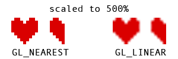
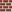
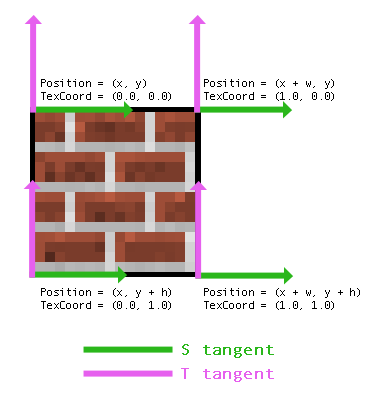
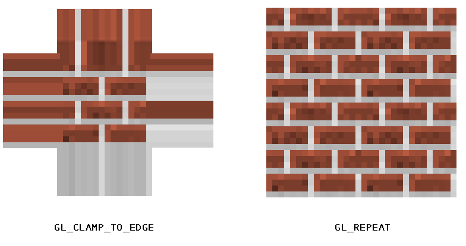
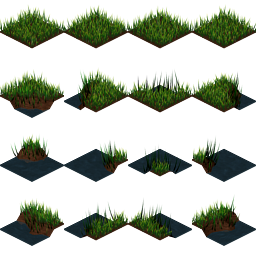

##### [start](https://github.com/mattdesl/lwjgl-basics/wiki) » Textures
***

This is a short introduction to textures in LWJGL. Our end result will be a Texture class which we can use in our simple sprite engine. If you are using LibGDX, you might rather read [this tutorial](LibGDX-Textures).

### Primer: Digital Images

An image, as you may know, is simply an array of colors, rendered in two dimensions. Let's use this very small image as an example; a heart sprite and a half-heart sprite:   


Now, when we zoom in on the image in Photoshop or another program, we can clearly see how the image is constructed of individual pixels:    


There are a number of ways an image like this would be stored on a computer, most commonly [RGBA with 8-bits per channel](http://en.wikipedia.org/wiki/RGBA_color_space). `RGB` refers to the red, green and blue channels, and `A` refers to the alpha (transparency) channel. Below are three different ways of storing the colour red:

  * **Hex aka RGB int:** `#ff0000` or `0xff0000`
  * **RGBA byte:** `(R=255, G=0, B=0, A=255)`
  * **RGBA float:** `(R=1f, G=0f, B=0f, A=1f)`


The RGBA byte array representing the above image (32x16 px) might look something like this:
```java
new byte[ imageWidth * imageHeight * 4 ] {
    0x00, 0x00, 0x00, 0x00, //Pixel index 0, position (x=0, y=0), transparent black
    0xFF, 0x00, 0x00, 0xFF, //Pixel index 1, position (x=1, y=0), opaque red
    0xFF, 0x00, 0x00, 0xFF, //Pixel index 2, position (x=2, y=0), opaque red
    ... etc ...
}
```

As you can see, a single pixel is made up of four bytes. Keep in mind it's just a single-dimensional array! 
The size of the array is `WIDTH * HEIGHT * BPP`, where `BPP` (bytes per pixel) is in this case 4 (RGBA).
We will rely on the width in order to render it as a two-dimensional image.

Since an array of bytes can get very large, we generally use compression like PNG or JPEG in order to decrease the final file-size and distribute the image for web/email/etc.

### OpenGL Textures

In OpenGL, we use *textures* to store image data. OpenGL textures do not only store image data; they are simply float arrays stored on the GPU, e.g. useful for shadow mapping and other advanced techniques.

The basic steps of getting an image into a texture are as follows:

1. Decode into RGBA bytes
2. Get a new texture ID
3. Bind that texture
4. Set up any texture parameters
5. Upload the RGBA bytes to OpenGL

### Decoding PNG to RGBA bytes

OpenGL doesn't know anything about GIF, PNG, JPEG, etc; it only understands bytes and floats. So we need to decode our PNG image into a ByteBuffer. If you are unfamiliar with NIO buffers, [see this page](https://github.com/mattdesl/lwjgl-basics/wiki/Java-NIO-Buffers).

In order to do this, we will use Matthias Mann's open source pure-Java [PNGDecoder](http://hg.l33tlabs.org/twl/file/tip/src/de/matthiasmann/twl/utils/PNGDecoder.java). He also has some decoders for BMP, JPEG and TGA which you can find [here](http://hg.l33tlabs.org/TextureLoader/file/tip/src/de/matthiasmann/textureloader). 

To decode an image into a ByteBuffer, it looks like this:
```java
//get an InputStream from our URL
input = pngURL.openStream();

//initialize the decoder
PNGDecoder dec = new PNGDecoder(input);

//read image dimensions from PNG header
width = dec.getWidth();
height = dec.getHeight();

//we will decode to RGBA format, i.e. 4 components or "bytes per pixel"
final int bpp = 4;

//create a new byte buffer which will hold our pixel data
ByteBuffer buf = BufferUtils.createByteBuffer(bpp * width * height);

//decode the image into the byte buffer, in RGBA format
dec.decode(buf, width * bpp, PNGDecoder.Format.RGBA);

//flip the buffer into "read mode" for OpenGL
buf.flip();
```

### Creating the Texture

Although it's possible to bind multiple textures in OpenGL with multiple texture units, this guide
will only focus on using a single texture unit. Therefore, in order to change the parameters of a texture,
or in order to send the RGBA bytes to OpenGL, we first need to *bind* that texture, i.e. "make it the currently
active texture." We can use `glGenTextures` to retrieve a unique identifier (aka "texture name" or "texture handle")
so that GL knows which texture we are trying to bind. 

The process of creating a texture and uploading the RGBA bytes looks like this:

```java
//Generally a good idea to enable texturing first
glEnable(GL_TEXTURE_2D);

//generate a texture handle or unique ID for this texture
id = glGenTextures();

//bind the texture
glBindTexture(GL_TEXTURE_2D, id);

//use an alignment of 1 to be safe
//this tells OpenGL how to unpack the RGBA bytes we will specify
glPixelStorei(GL_UNPACK_ALIGNMENT, 1);

//set up our texture parameters
glTexParameteri(...);

//upload our ByteBuffer to GL
glTexImage2D(GL_TEXTURE_2D, 0, GL_RGBA, width, height, 0, GL_RGBA, GL_UNSIGNED_BYTE, buf);		
```

The call to `glTexImage2D` is what sets up the actual texture in OpenGL. We can call this again later if we decide to change the width and height of our image, or if we need to change the RGBA pixel data.
If we only want to change a portion of the RGBA data (i.e. a sub-image), we can use `glTexSubImage2D`. For per-pixel modifications, however, we will generally rely on fragment shaders, which we will look into later.


*Note:* You can read about why we use GL_UNPACK_ALIGNMENT [here](http://www.opengl.org/wiki/Common_Mistakes#Texture_upload_and_pixel_reads).

### Texture Parameters

Before calling `glTexImage2D`, it's essential that we set up our texture parameters correctly. The code to do that looks like this:
```java
//Setup filtering, i.e. how OpenGL will interpolate the pixels when scaling up or down
glTexParameteri(GL_TEXTURE_2D, GL_TEXTURE_MIN_FILTER, GL_NEAREST);
glTexParameteri(GL_TEXTURE_2D, GL_TEXTURE_MAG_FILTER, GL_NEAREST);

//Setup wrap mode, i.e. how OpenGL will handle pixels outside of the expected range
//Note: GL_CLAMP_TO_EDGE is part of GL12
glTexParameteri(GL_TEXTURE_2D, GL_TEXTURE_WRAP_S, GL_CLAMP_TO_EDGE);
glTexParameteri(GL_TEXTURE_2D, GL_TEXTURE_WRAP_T, GL_CLAMP_TO_EDGE);
```

#### Filtering 

The minification/magnification filters define how the image is handled upon scaling. For "pixel-art" style games, generally `GL_NEAREST`
is suitable as it leads to hard-edge scaling without blurring. Specifying `GL_LINEAR` will use bilinear scaling
for smoother results, which is generally effective for 3D games (e.g. a 1024x1024 rock or grass texture) but not
so for a 2D game:  


#### Wrap Modes

To explain this, we need to understand a bit more about *texture coordinates* and vertices. Let's take a simple two dimensional image, like the following brick texture:  


To render the above object, we need to give OpenGL four **vertices**. As you can see, we end up with a 2D quad. Each vertex has a number of attributes, including Position (x, y) and Texture Coordinates (s, t). Texture coordinates are defined in *tangent space*, generally between 0.0 and 1.0. These tell OpenGL where to sample from our texture data. Here is an image showing the attributes of each vertex in our quad:  


*Note:* This depends on our coordinate system having an origin in the upper-left ("Y-down"). Some libraries, like LibGDX, will use lower-left origin ("Y-up"), and so the values for Position and TexCoord may be in a different order.

Sometimes programmers and modelers use `UV` and `ST` interchangeably -- "UV Mapping" is another way to describe how textures are applied to a 3D mesh.

So what happens if we use texture coordinate values less than 0.0, or greater than 1.0? This is where the *wrap mode* comes into play. We tell OpenGL how to handle values outside of the texture coordinates. The two most common modes are `GL_CLAMP_TO_EDGE`, which simply samples the edge color, and `GL_REPEAT`, which will lead to a repeating pattern. For example, using 2.0 and `GL_REPEAT` will lead to the image being repeated twice within the *width* and *height* we specified. Here is an image to demonstrate the differences between clamping and repeat wrap modes:



### Debug Rendering

Before we get into the programmable pipeline and our sprite batching system, we can "test render" our texture. These calls (glMatrixMode, glBegin, glColor4f, glVertex2f, etc) are deprecated, and should not be used aside from simple debugging purposes. Once our sprite batcher is set up, we will no longer need to rely on deprecated code to draw a texture.

```java
public static void debugTexture(Texture tex, float x, float y, float width, float height) {
	//usually glOrtho would not be included in our game loop
	//however, since it's deprecated, let's keep it inside of this debug function which we will remove later
	glMatrixMode(GL_PROJECTION);
	glLoadIdentity();
	glOrtho(0, Display.getWidth(), Display.getHeight(), 0, 1, -1);
	glMatrixMode(GL_MODELVIEW);
	glLoadIdentity();
	glEnable(GL_TEXTURE_2D); //likely redundant; will be removed upon migration to "modern GL"

	//bind the texture before rendering it
	tex.bind();

	//setup our texture coordinates
	//(u,v) is another common way of writing (s,t)
	float u = 0f;
	float v = 0f;
	float u2 = 1f;
	float v2 = 1f;

	//immediate mode is deprecated -- we are only using it for quick debugging
	glColor4f(1f, 1f, 1f, 1f);
	glBegin(GL_QUADS);
		glTexCoord2f(u, v);
		glVertex2f(x, y);
		glTexCoord2f(u, v2);
		glVertex2f(x, y + height);
		glTexCoord2f(u2, v2);
		glVertex2f(x + width, y + height);
		glTexCoord2f(u2, v);
		glVertex2f(x + width, y);
	glEnd();
}
```

As you can see, the concept here is the same as we described in our earlier image. We are specifying a quad with texture coordinates 0.0 and 1.0. 

### Texture Atlases

One thing I haven't mentioned yet is the importance of texture atlases or "sprite sheets." Since we are only binding one texture at a time, this can be costly if we plan to draw many sprites or tiles per frame. Instead, it's almost always a better idea to place all of your tiles and sprites into a single image, so that you are only binding minimal textures per frame.

Here is one example of a texture atlas:  


As you might have noticed from the *Texture Wrap* section, we can tell OpenGL what part of our texture to render by specifying different texture coordinates. For example, say we want to render the grass tile at (1, 1), then texture coordinates would be set up like so:
```java
float srcX = 64;
float srcY = 64;
float srcWidth = 64;
float srcHeight = 64;

float u = srcX / tex.width;
float v = srcY / tex.height;
float u2 = (srcX + srcWidth) / tex.width;
float v2 = (srcY + srcHeight) / tex.height;
```

Here is a visual breakdown of each vertex:  


The above would be better suited in its own method, such as `drawDebugRegion`. Later, we will examine the [TextureRegion](https://github.com/mattdesl/lwjgl-basics/blob/master/src/mdesl/graphics/TextureRegion.java) utility class, which will simplify the process of handling sprite sheets and sub-images.

*Note:* As we discussed earlier, using `GL_LINEAR` will lead to bilinear interpolation when scaling -- i.e. the nearest four pixels will be selected and blended together. This can lead to unwanted effects when scaling a texture atlas, where "bleeding" occurs at the edge of sprites, and so it's often wise to use `GL_NEAREST` and/or pad each sprite in your atlas with a transparent 1-2px border.


<a name="HardwareLimitations" />
## Hardware Limitations

### Max Texture Size

You can query the maximum texture width and height with the following:
```java
int maxSize = glGetInteger(GL_MAX_TEXTURE_SIZE);
```

Generally, most modern computers allow for at least 4096x4096 textures, but if you want to be really safe, you can limit yourself to 2048x2048. If you think you will be working with old or limiting drivers (or Android, iOS, WebGL), you may want to limit yourself to 1024x1024.

### Power of Two Sizes
One thing I have yet to note is the use of power-of-two (POT) dimensions. Historically, OpenGL only allowed POT texture dimensions:  
`1, 2, 4, 8, 16, 32, 64, 128, 256, 512, 1024, 2048, 4096... etc`

Today, however, most drivers will support non-power-of-two (NPOT) texture sizes. You can check to see if your user supports NPOT textures with the following code:  
```java
boolean npotSupported = GLContext.getCapabilities().GL_ARB_texture_non_power_of_two;
```

It should be noted that even if the driver does support NPOT textures, it's generally still advisable to stick to POT sizes as it will often lead to better performance and storage. At a later point, this tutorial may include a segment on padding NPOT textures to a power-of-two size, for drivers that don't support NPOT textures.

## Advanced Topics

If you're ready to move onto something more advanced, check out the [shader programming series](Shaders).

## Full Source Code

Below is the full source of our simple texture wrapper. See the [repo](https://github.com/mattdesl/lwjgl-basics/blob/master/src/mdesl/graphics/Texture.java) for a more complete version, including better documentation.

```java
/**
 * Copyright (c) 2012, Matt DesLauriers All rights reserved.
 *
 *	Redistribution and use in source and binary forms, with or without
 *	modification, are permitted provided that the following conditions are met: 
 *
 *	* Redistributions of source code must retain the above copyright notice, this
 *	  list of conditions and the following disclaimer. 
 *
 *	* Redistributions in binary
 *	  form must reproduce the above copyright notice, this list of conditions and
 *	  the following disclaimer in the documentation and/or other materials provided
 *	  with the distribution. 
 *
 *	* Neither the name of the Matt DesLauriers nor the names
 *	  of his contributors may be used to endorse or promote products derived from
 *	  this software without specific prior written permission.
 *
 *	THIS SOFTWARE IS PROVIDED BY THE COPYRIGHT HOLDERS AND CONTRIBUTORS "AS IS"
 *	AND ANY EXPRESS OR IMPLIED WARRANTIES, INCLUDING, BUT NOT LIMITED TO, THE
 *	IMPLIED WARRANTIES OF MERCHANTABILITY AND FITNESS FOR A PARTICULAR PURPOSE
 *	ARE DISCLAIMED. IN NO EVENT SHALL THE COPYRIGHT HOLDER OR CONTRIBUTORS BE
 *	LIABLE FOR ANY DIRECT, INDIRECT, INCIDENTAL, SPECIAL, EXEMPLARY, OR
 *	CONSEQUENTIAL DAMAGES (INCLUDING, BUT NOT LIMITED TO, PROCUREMENT OF
 *	SUBSTITUTE GOODS OR SERVICES; LOSS OF USE, DATA, OR PROFITS; OR BUSINESS
 *	INTERRUPTION) HOWEVER CAUSED AND ON ANY THEORY OF LIABILITY, WHETHER IN
 *	CONTRACT, STRICT LIABILITY, OR TORT (INCLUDING NEGLIGENCE OR OTHERWISE)
 *	ARISING IN ANY WAY OUT OF THE USE OF THIS SOFTWARE, EVEN IF ADVISED OF THE
 *	POSSIBILITY OF SUCH DAMAGE.
 */
package mdesl.graphics;

import static org.lwjgl.opengl.GL11.GL_CLAMP;
import static org.lwjgl.opengl.GL11.GL_LINEAR;
import static org.lwjgl.opengl.GL11.GL_NEAREST;
import static org.lwjgl.opengl.GL11.GL_REPEAT;
import static org.lwjgl.opengl.GL11.GL_RGBA;
import static org.lwjgl.opengl.GL11.GL_TEXTURE_2D;
import static org.lwjgl.opengl.GL11.GL_TEXTURE_MAG_FILTER;
import static org.lwjgl.opengl.GL11.GL_TEXTURE_MIN_FILTER;
import static org.lwjgl.opengl.GL11.GL_TEXTURE_WRAP_S;
import static org.lwjgl.opengl.GL11.GL_TEXTURE_WRAP_T;
import static org.lwjgl.opengl.GL11.GL_UNPACK_ALIGNMENT;
import static org.lwjgl.opengl.GL11.GL_UNSIGNED_BYTE;
import static org.lwjgl.opengl.GL11.glBindTexture;
import static org.lwjgl.opengl.GL11.glEnable;
import static org.lwjgl.opengl.GL11.glGenTextures;
import static org.lwjgl.opengl.GL11.glPixelStorei;
import static org.lwjgl.opengl.GL11.glTexImage2D;
import static org.lwjgl.opengl.GL11.glTexParameteri;
import static org.lwjgl.opengl.GL12.GL_CLAMP_TO_EDGE;

import java.io.IOException;
import java.io.InputStream;
import java.net.URL;
import java.nio.ByteBuffer;

import org.lwjgl.BufferUtils;

import de.matthiasmann.twl.utils.PNGDecoder;

public class Texture {

	public final int target = GL_TEXTURE_2D;
	public final int id;
	public final int width;
	public final int height;

	public static final int LINEAR = GL_LINEAR;
	public static final int NEAREST = GL_NEAREST;

	public static final int CLAMP = GL_CLAMP;
	public static final int CLAMP_TO_EDGE = GL_CLAMP_TO_EDGE;
	public static final int REPEAT = GL_REPEAT;

	public Texture(URL pngRef) throws IOException {
		this(pngRef, GL_NEAREST);
	}

	public Texture(URL pngRef, int filter) throws IOException {
		this(pngRef, filter, GL_CLAMP_TO_EDGE);
	}

	public Texture(URL pngRef, int filter, int wrap) throws IOException {
		InputStream input = null;
		try {
			//get an InputStream from our URL
			input = pngRef.openStream();
			
			//initialize the decoder
			PNGDecoder dec = new PNGDecoder(input);

			//set up image dimensions 
			width = dec.getWidth();
			height = dec.getHeight();
			
			//we are using RGBA, i.e. 4 components or "bytes per pixel"
			final int bpp = 4;
			
			//create a new byte buffer which will hold our pixel data
			ByteBuffer buf = BufferUtils.createByteBuffer(bpp * width * height);
			
			//decode the image into the byte buffer, in RGBA format
			dec.decode(buf, width * bpp, PNGDecoder.Format.RGBA);
			
			//flip the buffer into "read mode" for OpenGL
			buf.flip();

			//enable textures and generate an ID
			glEnable(target);
			id = glGenTextures();

			//bind texture
			bind();

			//setup unpack mode
			glPixelStorei(GL_UNPACK_ALIGNMENT, 1);

			//setup parameters
			glTexParameteri(target, GL_TEXTURE_MIN_FILTER, filter);
			glTexParameteri(target, GL_TEXTURE_MAG_FILTER, filter);
			glTexParameteri(target, GL_TEXTURE_WRAP_S, wrap);
			glTexParameteri(target, GL_TEXTURE_WRAP_T, wrap);

			//pass RGBA data to OpenGL
			glTexImage2D(target, 0, GL_RGBA, width, height, 0, GL_RGBA, GL_UNSIGNED_BYTE, buf);
		} finally {
			if (input != null) {
				try { input.close(); } catch (IOException e) { }
			}
		}
	}

	public void bind() {
		glBindTexture(target, id);
	}
}
```