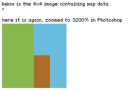
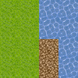

There are a lot of different ways to store tile map data. Generally speaking, you will want to use something like [Tiled Map Editor](http://www.mapeditor.org/) and the TMX format, to avoid re-inventing the wheel with your own editor. However, for extremely simple applications, or for highly specialized applications, you can use any pixel editing application (Paint, Gimp, Photoshop) as your map editor, and save the map data as an image.

For example, in the map below, green `(R=135, G=184, B=78)` or `#87b84e` corresponds to the grass tile type.

When loading the map in game, we simply loop through our image and substitute tile types based on image color. The resulting in-game map might look like this:

As a bonus, the map data is extremely well compressed as a GIF or PNG, making it ideal for small programs (like Java4K). 

This technique will not be suitable if you intend to add many tile types, event triggers, items, etc. 